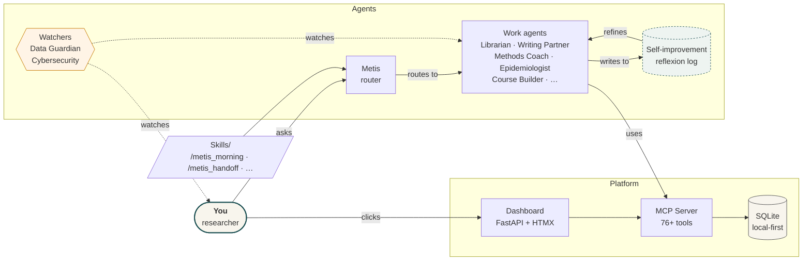

<p align="center">
  
</p>

<h1 align="center">Metis</h1>
<p align="center"><strong>The Research Cortex</strong></p>

<p align="center"><em>A second brain, configured for AI use.</em></p>

> ⚠️ **Status.** I currently use Metis for all my research work, but some features are still under construction. This is an open-source project for researchers — feedback is very welcome, on the functionality, on the idea itself, and on the user experience.

---

## The underlying idea

Not every researcher will have the time to keep up with AI. The Research Cortex is a second brain configured for AI use — an MCP server and platform that places every question you ask an AI into the context of *your* field of research, your ideas, your notes, your literature, your projects, and your recent world.

Under the hood it is a collection of agents with safety guardrails that watch each other, a multi-layered memory that cross-pollinates your thoughts with past work and recent advancements, and a local-first dashboard that gives you one place to see what you're working on and what's new.

The innovation is not in the components. It's in **how the components interact with each other — and how you interact with them**.

---

## How it works



*Your questions are routed by Metis to the right specialist agents. Every call passes under the eyes of the Data Guardian (PII, data protection) and the Cybersecurity agent (prompt injection, URL validation). Agents read and write to a shared local memory. A self-improvement loop captures what worked and what didn't so agents become more personalized with use.*

---

## Under the hood

- **An MCP server + platform** — 76+ tools registered, a FastAPI + HTMX dashboard with 9 tabs
- **Local-first** — your data stays on your machine. No database leaves without your consent
- **20+ agents** — Librarians, Epidemiologists, Course Builders, Content Harvesters, Teachers, Writing Partners, Visualization Makers, plus two watchers: Data Guardian and Cybersecurity
- **Multi-layered memory** — episodic (what happened), semantic (concepts), procedural (workflows), working (scratchpad), reflexive (self-critique)
- **Self-improvement loop** — agents evaluate each other's output and your response, so they improve over time and become more personalized
- **Cross-pollination** — every idea, note, paper, meeting, and news brief is connected so insights from one area seed another
- **Claude-based** — runs against Anthropic's Claude models. Lower-cost models for quick work, stronger models for deep work. Token-efficient by design

---

## Features

- **Cross-pollination** between your ideas, literature, old notes, research, news, and meetings
- **Build your own courses** to grow your skills — the Course Builder Agent scrapes sources, designs curriculum with proven pedagogy, and publishes into your Learning tab
- **Adaptive courses** — tell Metis your research question and methodology, and Metis teaches you the knowledge and skills you need
- **Continuity across your research** — your articles, projects, and ideas stay connected via the knowledge graph
- **Full library organization** with Zotero-style metadata and a force-directed knowledge graph
- **Idea capture** — Ctrl+K from anywhere on the dashboard
- **Meeting assistant** that records, structures, and gives you feedback
- **Project tracking** with per-project PLANNING.md files
- **Weekly focus board** — define what the week is for
- **Data protection and security** — databases never leave, PII is anonymized at the boundary
- **Efficient token use** — each agent runs on the cheapest Claude model that can do the job; context clears automatically between sessions

---

## Workflows

Three modes, all first-class:

1. **Dashboard-first morning** — open the dashboard, see what needs attention, click a launcher to jump into Claude Code / VS Code / RStudio with context already loaded.
2. **External → dashboard during work** — Claude Desktop with MCP tools writes to the Metis DB every tool call. The dashboard polls for updates and shows a reload prompt.
3. **Files → dashboard via scan** — after you've edited code externally, click "Scan now" on the dateline to re-check git status and file changes.

*Screenshots coming soon.*

---

## Getting started

> *Not yet packaged for general release. Rough instructions for developers who want to try it now:*

```bash
git clone <this-repo>
cd research-cortex/metis/system/mcp-server
python3.12 -m venv .venv
source .venv/bin/activate
pip install -e .
# Then configure Claude Code to point to the MCP server — see metis/CLAUDE.md
cd ../app-py
./run.sh   # → http://127.0.0.1:8000
```

---

## Project status

See [metis/system/config/implementation-progress.json](metis/system/config/implementation-progress.json) for a full milestone tracker.

**Current:** Editorial redesign v7.1 live · Course Builder Agent shipped · 20 CLI skills active · RSS content scan integrated · Token efficiency work underway.

---

## Contributing

This is a single-researcher project right now, but feedback, issues, and PRs are welcome. Especially interesting: your workflows, what agents you would want next, and how you'd use Metis in your own research.

---

## License

*TBD — leaning toward MIT for the codebase, CC-BY-SA for courses. See `LICENSE` once added.*
