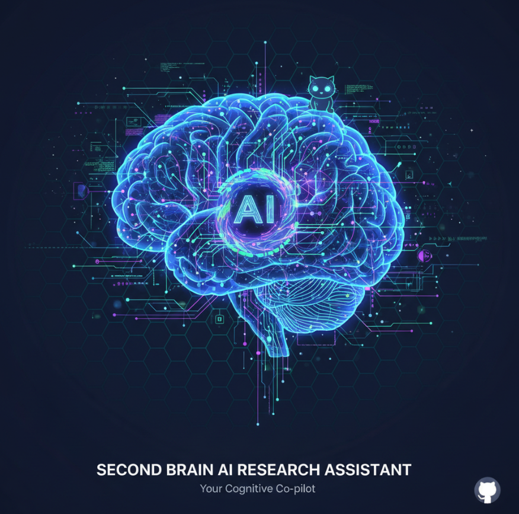
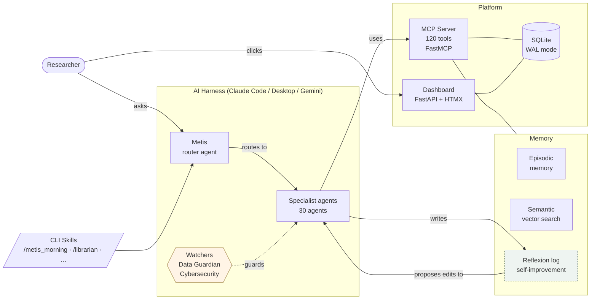

<p align="center">
  <picture>
    <source media="(prefers-color-scheme: dark)" srcset="Metis_github.png"/>
    
  </picture>
</p>

<h1 align="center">Metis — The Research Cortex</h1>

<p align="center">
  <em>A gateway to AI for researchers. Not a tool — a way of working.</em>
</p>

<p align="center">
  <a href="https://github.com/SVerITG/Metis_pers/stargazers"></a>
  <a href="https://github.com/SVerITG/Metis_pers/blob/main/LICENSE"></a>
  
  
  
</p>

---

## Table of Contents

- [For Researchers](#for-researchers) — plain language, quick start, what you get
- [For Developers](#for-developers) — architecture, installation options, contributing
- [Contributing](#contributing) — how to add domain backgrounds, agents, and skills
- [License](#license)

---

# For Researchers

*If you are a researcher who wants to use AI seriously but does not want to spend weeks setting it up, this section is for you. No technical knowledge required to read this.*

---

## What is Metis?

Every researcher has the same problem with AI tools: each conversation starts from zero. The AI doesn't know your topic, your papers, your ongoing projects, or what you were thinking about last Tuesday. You spend the first ten minutes re-explaining your context — and then the session ends and it's gone.

Metis solves this by building a **research cortex** — a persistent, connected knowledge layer that sits underneath every AI conversation you have. It knows your literature, your ideas, your meetings, your projects, and your recent world. When you ask a question, it doesn't just answer — it answers *in the context of everything you're working on*.

**This is the gateway idea.** Metis makes AI work like a brilliant colleague who has read everything you've read, been in every meeting you've been in, and remembers every idea you've captured. You don't change the way you work. Metis learns from how you work.

---

## Why does this matter for researchers specifically?

Most AI tools are built for software developers or general users. Researchers have specific needs that general tools don't address:

- Your work spans years, not days. Context needs to persist.
- You work with sensitive data (patient data, unpublished findings) that must never leave your machine.
- You have a literature that needs to stay connected to your ideas and your writing.
- You often work alone, without a team to help you track what's in progress.
- You are not a developer — you want AI to work *for* you, not require you to learn to configure it.

Metis is designed from the ground up for this profile. It runs locally (your data stays on your machine). It connects to your reference manager (Zotero or Mendeley). It tracks your PhD progress or research articles. It generates a morning briefing every day from your actual work. And it gets smarter with use, because it watches what works and what doesn't, and updates itself accordingly.

---

## How Metis stays current

AI development moves quickly. Metis addresses this in two ways:

**Continuous updates:** As new capabilities emerge in Claude, new tools are built, or better approaches to common research tasks are discovered, Metis is updated through regular releases. These improvements come from monitoring the AI tooling landscape and incorporating the best new ideas.

**Self-improvement loop (bi-weekly):** Every two weeks, Metis does something unusual — it evaluates itself. It reads its own recent conversations, identifies patterns (what worked, what didn't, what was missing), and generates proposals to improve its own agents and skills. It also scans the internet for new AI features, new open-source tools, and new research on AI for researchers. This can result in new agents, new skills, better responses. You review and approve each proposed change before it's applied.

This means Metis improves based on your specific usage — not just generic updates.

---

## What does it look like?

Metis has two faces:

**The dashboard** — a local web interface (opens in your browser) with nine tabs:

| Tab | What you see |
|---|---|
| **Today** | Morning briefing — what's new, what needs attention, your current focus |
| **Knowledge** | Your library, literature cards, domain notes, knowledge graph |
| **Meetings** | Meeting notes with structured action items and follow-ups |
| **Learning** | Courses you're taking or building, spaced repetition, skill map |
| **Work** | Tasks, projects, open in VS Code / RStudio / Claude with one click |
| **Thinking** | Ideas, notes, questions, brainstorm launcher |
| **Planner** | Kanban board, PhD focus, timeline |
| **Teach** | Courses you teach — literature alerts, course build tools |
| **Metis** | Agent run history, self-improvement proposals, system health |

**The AI assistant** — Metis works inside Claude Desktop or Claude Code. You can talk to it naturally. "What new papers arrived on sleeping sickness this week?" or "Help me outline the methods section for Article 2" — it knows your context and routes your request to the right specialist.

---

## Who uses Metis and what do they get?

**The researcher in public health or epidemiology** (current focus)
Opens their computer at 7 am. The dashboard shows a paragraph: three papers arrived overnight on their topic, one connects to their methodology question, WHO flagged an outbreak update. Their two most urgent tasks are highlighted. A new idea they captured last week has been connected to a paper they read six months ago.

**The PhD student**
Has three articles in progress that need to connect to a thesis backbone. Metis tracks all three simultaneously, flags when a new paper changes the argument, suggests where to focus this week, and remembers what the supervisor said in the last meeting.

**The researcher in any other domain** (coming soon — see [domain backgrounds](#research-domain-backgrounds))
Social scientist, economist, biomedical researcher, climate scientist, legal scholar — Metis can be configured for any research background. The current version ships with Public Health and Epidemiology preloaded. Domain packs for other fields are in active development.

---

## Install: the easy way (Windows, no technical knowledge needed)

> **Coming in v1.0:** A `.exe` installer that handles everything — Python, virtual environment, dashboard setup, Windows shortcut. Download, double-click, answer a few questions, done.
>
> Until then, use the one-line install below — it takes about 5 minutes and only requires opening a terminal.

### Before you start — three things to install once

These are standard tools any modern research workflow expects. None of them is Metis-specific.

**Step 1 — WSL (Linux on Windows)**

Open PowerShell as Administrator and run:
```powershell
wsl --install
```
Restart when prompted. After restart, open **Ubuntu** from the Start Menu and complete first-time setup (pick a username and password).

*If WSL is already on your machine, skip this.*

**Step 2 — Claude Desktop or Claude Code**

- [Claude Desktop](https://claude.ai/download) — recommended for non-developers. Download and sign in.
- Claude Code (terminal) — see the [install guide](https://docs.claude.com/en/docs/claude-code).

You only need one. Most researchers start with Claude Desktop.

**Step 3 — An Anthropic API key**

Go to [console.anthropic.com](https://console.anthropic.com), create a workspace, copy your API key. You will paste it during Metis setup.

---

### Light setup — just the AI layer, no dashboard

If you want to try Metis with minimal setup: this option gives you the AI assistant (all 120 tools, all 30 agents) inside Claude Desktop or Claude Code, without the dashboard.

Open Ubuntu (Start Menu → Ubuntu) and paste:

```bash
bash <(curl -fsSL https://raw.githubusercontent.com/SVerITG/Metis_pers/main/metis/system/mcp-server/setup-mcp.sh)
```

Follow the prompts. Done in ~5 minutes.

---

### Full setup — dashboard + AI assistant + automation

This gives you everything: the full dashboard, morning briefings, automated daily scans, and the complete AI assistant layer.

```bash
bash <(curl -fsSL https://raw.githubusercontent.com/SVerITG/Metis_pers/main/metis/system/mcp-server/setup-mcp.sh)
```

Then start the dashboard:
```bash
cd ~/Metis_pers/metis/system/app-py && bash run.sh
```

Open [http://127.0.0.1:8000](http://127.0.0.1:8000) in your browser. The dashboard is running.

*To start the dashboard automatically when you log in, click "Schedule morning brief" on the Today tab's dateline. This registers a Windows Task Scheduler entry.*

---

## Research domain backgrounds

When you first run Metis, the setup wizard asks about your research background. This is how Metis personalises itself for your field — it loads the right journals, databases, monitoring feeds, and specialist agents.

**Current version:** Public Health and Epidemiology (fully loaded, preloaded with Statistics)

**In development:**
- Biomedical Sciences / Clinical Research
- Social Sciences
- Economics and Development Economics  
- Environmental Science and Climate
- Psychology and Behavioral Sciences
- Law and Policy
- Education Research
- Nursing and Allied Health

**Future vision:**
Metis will ship in three forms: *Empty Research Cortex* (you build it from scratch), *Metis by Domain* (pre-configured for your field), and the current form, *Metis Public Health & Epidemiology*. When you select your domain during setup, Metis builds your personalised version — loading the databases, RSS feeds, agents, and terminology relevant to your work.

*Want your domain included? See [Contributing](#contributing).*

---

## What you get on day one

After setup, here is what is immediately available:

- **30 specialist agents** — Librarian, Epidemiologist, Writing Partner, Methods Coach, Meeting Memory, Course Builder, Career Coach, and 23 others
- **135 MCP tools** — for literature search, idea capture, meeting notes, cross-pollination, PDF semantic search, data analysis, and more
- **9-tab dashboard** — local, runs in your browser, no internet required for most features
- **Daily news scan** — 23 RSS feeds covering disease surveillance, NTD research, global health policy, AI developments, and world news
- **Zotero / Mendeley integration** — import your existing library
- **Cross-pollination** — when you capture a new idea, Metis automatically surfaces connections to your papers, meetings, and past ideas
- **Self-improvement loop** — agents improve based on how they perform for you specifically

---

---

# For Developers

*This section covers the architecture, full installation options, configuration, and how to extend Metis. It assumes familiarity with Python, Git, and the command line.*

---

## What is Metis technically?

Metis is an **MCP server** (Model Context Protocol) with a **FastAPI + HTMX dashboard**. The MCP server exposes 135 tools that any compatible AI harness can use. The dashboard provides a web UI for the same underlying data. A SQLite database connects them.

**Key design decisions:**
- **Local-first.** All data stays on your machine. No external database, no cloud sync for research data. OneDrive/Dropbox sync works because the data is just files and a SQLite database.
- **MCP as the integration layer.** The MCP protocol means Metis works inside Claude Code, Claude Desktop, and (via the same tool definitions) other harnesses that support MCP. The tools are the API.
- **No JavaScript framework.** The dashboard uses HTMX for interactivity, Jinja2 for templates, and vanilla CSS. It's fast, maintainable, and doesn't require a Node.js build step.
- **Self-improving by design.** The reflexion/proposal pipeline is not a plugin — it's built into the agent execution loop. Every agent run writes a reflexion; the aggregation job reads them weekly and proposes skill file edits.

---

## Architecture



---

## Stack

| Layer | Technology |
|---|---|
| AI harness | Claude Code, Claude Desktop (primary); Gemini (experimental) |
| MCP server | Python 3.10+, FastMCP, runs in WSL venv |
| Dashboard | FastAPI + HTMX + Jinja2, no JavaScript framework |
| Database | SQLite (WAL mode, 46 tables, ~500 KB typical) |
| Vector memory | sqlite-vec + nomic-embed-text-v1.5-Q (768 dims, local) |
| Host OS | Windows + WSL2 (Ubuntu 20/22/24) |
| File sync | OneDrive / Dropbox (optional, works transparently) |

---

## Installation options

### Option 1 — Single command (recommended)

```bash
bash <(curl -fsSL https://raw.githubusercontent.com/SVerITG/Metis_pers/main/metis/system/mcp-server/setup-mcp.sh)
```

The script: detects Ubuntu 20/22/24, creates a venv at `~/.local/share/metis-mcp/.venv`, installs all dependencies, writes the MCP launcher, prints tool count, auto-registers with Claude Code and Claude Desktop. Idempotent — safe to re-run.

### Option 2 — Manual

```bash
git clone https://github.com/SVerITG/Metis_pers.git
cd Metis_pers/metis/system/mcp-server
bash setup-mcp.sh
```

Start the dashboard:
```bash
cd ../app-py && bash run.sh   # → http://127.0.0.1:8000
```

### Option 3 — Docker (planned for v1.0)

```bash
docker run -p 8000:8000 \
  -v /path/to/your/data:/metis/data \
  -e METIS_RC_ROOT=/metis \
  ghcr.io/sveritg/metis:latest
```

### Option 4 — Windows .exe installer (planned for v1.0)

No terminal needed. Download, double-click, answer configuration questions. Sets up Python, venv, MCP registration, and Windows shortcut automatically.

---

## Register with Claude Code

`~/.claude/settings.json`:
```json
{
  "mcpServers": {
    "metis-rc": {
      "command": "/home/<user>/.local/share/metis-mcp/run.sh"
    }
  }
}
```

## Register with Claude Desktop (Windows + WSL)

`%APPDATA%\Claude\claude_desktop_config.json`:
```json
{
  "mcpServers": {
    "metis-rc": {
      "command": "wsl.exe",
      "args": ["-e", "bash", "/home/<user>/.local/share/metis-mcp/run.sh"]
    }
  }
}
```

---

## Full dependency list

Metis brings in the following dependencies. The setup script handles all of them — this list is for reference and for those doing custom installs.

**Python packages (MCP server + dashboard, auto-installed):**

| Package | Purpose |
|---|---|
| `mcp`, `fastmcp` | MCP protocol server |
| `fastapi`, `uvicorn`, `starlette` | Dashboard web server |
| `htmx` (CDN or local) | Dashboard interactivity |
| `jinja2` | Dashboard templates |
| `sqlite-vec` | Local vector similarity search |
| `fastembed` | nomic-embed-text-v1.5-Q local embeddings (768 dims) |
| `feedparser` | RSS feed parsing (23 feeds) |
| `pyyaml` | User config parsing |
| `httpx` | Async HTTP (Claude API calls, feeds) |
| `pandas`, `openpyxl`, `pyreadstat` | Data analyst tab (CSV/Excel/SPSS/Stata) |
| `cryptography` | AES-256-GCM backup encryption |
| `google-genai` | Gemini harness support (experimental) |
| `pyzotero` | Zotero library sync |
| `bibtexparser` | Mendeley BibTeX import |
| `twilio` | WhatsApp capture webhook (optional) |

**External tools (install separately if needed):**

| Tool | Required for | Install |
|---|---|---|
| WSL + Ubuntu | Everything on Windows | `wsl --install` in PowerShell |
| Claude Desktop or Claude Code | AI harness | [claude.ai/download](https://claude.ai/download) |
| R + RStudio | R statistical analysis, R Shiny (legacy dashboard) | [posit.co](https://posit.co/download/rstudio-desktop/) |
| Quarto | Course Builder (renders lessons) | [quarto.org](https://quarto.org/docs/get-started/) |
| Zotero | Reference manager sync | [zotero.org](https://www.zotero.org) |
| Ollama (optional) | Local LLM for offline PII screening | [ollama.com](https://ollama.com) |
| NSSM (optional) | Run dashboard as Windows service | [nssm.cc](https://nssm.cc) |
| Tailscale (optional) | Mobile dashboard access | [tailscale.com](https://tailscale.com) |

**R packages (required only if using the legacy R Shiny dashboard or R-based course tools):**

```r
install.packages(c(
  "shiny", "shinydashboard", "DBI", "RSQLite", "dplyr",
  "ggplot2", "plotly", "htmltools", "yaml", "jsonlite",
  "lubridate", "stringr", "purrr", "readr", "tidyr"
))
```

---

## Configuration

All configuration is file-based — no database required for settings.

| File | What it controls |
|---|---|
| `system/config/user-config.yaml` | Your name, domain, thinking style, preferences |
| `system/config/constitution.md` | 12 rules applied to every deep/chain agent run |
| `system/config/red-lines.md` | 5 non-overridable rules (patient data, API keys, etc.) |
| `system/config/token-guardrails.md` | Model routing per agent, handoff thresholds |
| `agents/<name>/skill.md` | Behavioural contract for each agent — directly editable |
| `.claude/hooks/pre-tool-use.mjs` | Security gate on all tool calls |

The self-improvement loop proposes changes to `skill.md` files based on agent reflexions. You approve each change in the Metis tab before it's written.

---

## Under the hood

**Memory (5 layers):**
1. `episodic` — session events, observations (discovery / decision / implementation / issue)
2. `semantic` — vector-indexed full text (sqlite-vec + nomic-embed-text-v1.5-Q, 768 dims)
3. `procedural` — skill files and agent contracts (the agent's persistent behaviour)
4. `working` — active session context, current project focus
5. `reflexive` — reflexion log and improvement proposals

**Self-improvement loop:**
1. After every deep/chain run: `write_reflexion()` logs what went well / could improve / was missing
2. Weekly: `aggregate_reflexions()` extracts semantic themes using Claude Haiku
3. `draft_self_improvement_proposal()` writes a proposed skill.md edit with rationale
4. User reviews in Metis tab → `apply_proposal()` writes to disk with timestamped backup

**Security layers:**
1. `pre-tool-use.mjs` — 12 injection patterns, domain allowlist, path restrictions (fires on every tool call)
2. `guardrails.py` — injection probe wrapping all external content (same 12 patterns)
3. `safety.py` — 14 PII checks, 4-level classification, hard block on patient data
4. `constitution.md` — 12 machine-readable rules loaded for deep/chain runs
5. `red-lines.md` — 5 non-overridable rules enforced at code level

**Token efficiency:**
- Haiku for summaries and quick lookups; Sonnet for most work; Opus for deep reasoning
- Surgical context assembly per agent (not full history on every call)
- Observation classification: recalls by type, not by dumping the whole log
- Handoff brief at session end (< 3 KB, captures state for next session)
- Max-turns guardrail (stops at 20 turns, prompts `/clear`)

---

## Cross-AI / cross-harness support

| Harness | Status | Notes |
|---|---|---|
| Claude Code (CLI) | ✅ Primary | Full support — all skills, hooks, MCP |
| Claude Desktop | ✅ Primary | Full MCP tools + memory; no CLI skills |
| Gemini 2.0+ | 🔬 Experimental | `google-genai` package installed; `.gemini/GEMINI.md` in progress |
| OpenAI Codex | 🟡 Partial | MCP tools accessible; no Metis-specific routing |
| Cursor | 🟡 Partial | MCP tools accessible via MCP plugin |
| Any MCP-compatible harness | 🟡 Partial | Tools work; Metis routing not configured |

The MCP server is harness-agnostic. Any AI harness that supports MCP can use Metis's 120 tools. The Metis routing agent and CLI skills require Claude Code or Claude Desktop.

---

## Project status

See `metis/system/config/implementation-progress.json` for the full milestone tracker.

**Completed:** Phases 0–9b — foundations · dashboard (9 tabs) · 30 specialist agents · CLI skill layer · multi-layered memory · knowledge graph · self-improvement loop · token efficiency · content scan · Zotero/Mendeley integration · meeting assistant · cross-pollination engine

**In progress:** Phase 10 (automated daily tasks), Phase 11 (.exe installer), Phase 12 (test suite)

---

# Contributing

Metis is designed to grow beyond a single researcher and a single domain. This repository represents the intention and the architecture — the concept of a research cortex that any researcher can install and use. A lot still needs to be built, and we hope contributions will make Metis genuinely useful across research fields.

Contributions are welcome and encouraged. If you have:

- **Domain backgrounds** — knowledge packages that enrich Metis for your field
- **Useful agents or skills** — specialists that make Metis more capable
- **Clever hooks** — automations that improve workflow, security, or memory
- **Better MCP configurations** — improvements to the tool set
- **Improved rules** — better guardrails, security patterns, or constitutional rules
- **Installation improvements** — easier setup for specific platforms or institutions

Please contribute. See [CONTRIBUTING.md](metis/CONTRIBUTING.md) for guidelines.

---

## Ideas for contributions

### Domain backgrounds (most wanted)

The biggest gap: Metis currently ships with one domain (Public Health & Epidemiology). Every other research field is underserved. A domain background consists of:

- A curated list of key journals and RSS feeds for the field
- A set of domain-specific agents or skill overlays
- An ontology or vocabulary file (key terms, MeSH equivalents)
- PubMed/OpenAlex query templates for daily monitoring

| Domain | Status | What's needed |
|---|---|---|
| **Social Sciences** | 🔬 Planned | SSRN feeds, qualitative methods agent, ATLAS.ti integration, sociology journals |
| **Biomedical Sciences** | 🔬 Planned | ClinicalTrials.gov monitoring, MeSH vocabulary, biostatistics agent, PubMed MeSH queries |
| **Economics** | 🔬 Planned | NBER working papers, World Bank data API, econometrics methods agent, STATA workflows |
| **Environmental Science** | 🔬 Planned | NOAA/Copernicus feeds, GIS agent, climate data APIs, IPCC monitoring |
| **Psychology** | 🔬 Planned | PsycINFO queries, APA journals, behavioral methods agent |
| **Law & Policy** | 🔬 Planned | UN document monitoring, legal citation style, policy analysis agent |
| **Education Research** | 🔬 Planned | ERIC feeds, Bloom taxonomy framework, curriculum design agent |
| **Nursing & Allied Health** | 🔬 Planned | CINAHL, Cochrane, clinical guidelines monitoring |
| **Linguistics** | 🔬 Planned | LLBA feeds, corpus tools integration |

### Agents

- **Language-specific writing partners** — academic writing in French, German, Spanish
- **Domain-specific methodology reviewers** — RCT specialist, qualitative methods coach, economic evaluation expert, systematic review conductor
- **Institutional variants** — EU regulatory guidance agent, WHO normative documents agent, clinical trial GCP specialist

### Skills and hooks

- **Pre-commit hook** — validate that no patient data or API keys are staged before a git commit
- **Stop hook** — auto-generate handoff brief at session end (ECC pattern, high value)
- **Post-tool-use hook** — session pulse logging for tool-use observability
- **Reference manager connectors** — EndNote, RefWorks, Paperpile (Zotero and Mendeley already work)
- **Custom PubMed alert templates** — for different research topics

### Infrastructure

- ~~Better cross-pollination algorithms (semantic similarity via SPECTER2 or nomic-embed)~~ ✅ Done — nomic-embed-text-v1.5-Q (768-dim) + PaperQA2 library search
- Telegram bot for mobile idea capture
- ~~Mobile PWA capture page (Tailscale + FastAPI)~~ ✅ Done — `/capture` PWA route
- ~~Domain-specific tool loading (serve only relevant tools per agent, ~50% token reduction)~~ ✅ Done — `METIS_AGENT_SUBSET` env var

---

## The vision

We hope to end up with a product that a researcher can download in the easiest way possible and configure themselves — or that a research institute or department can develop further to provide to all their researchers. Metis could be enriched with institution-specific context: house style, internal data systems, domain-specific literature collections, shared project tracking.

If you are a research institute exploring this: the MCP architecture and the skill/agent model are designed with institutional deployment in mind. The constitution, red-lines, and data guardian were designed for environments where patient data and unpublished findings are involved. We would welcome conversations about adapting Metis for your department.

---

## License

MIT for the codebase. CC-BY-SA for course content and learning materials.

*LICENSE file ships with v1.0.*
