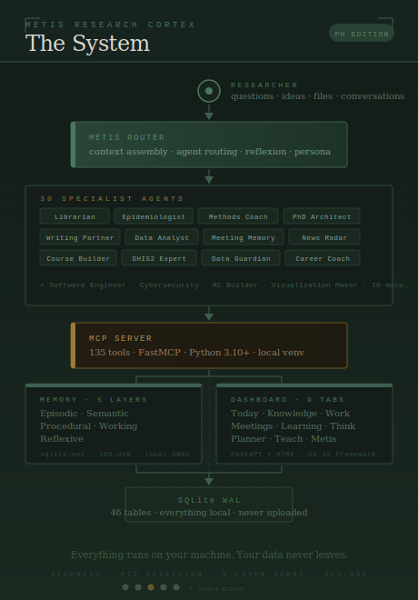
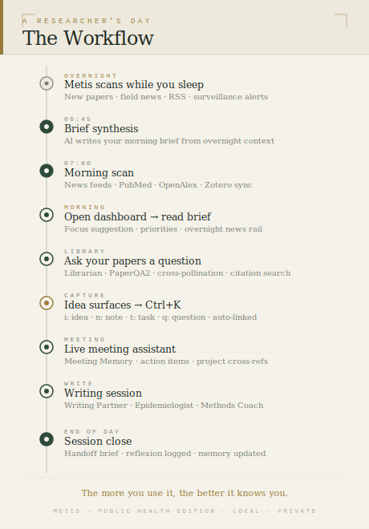
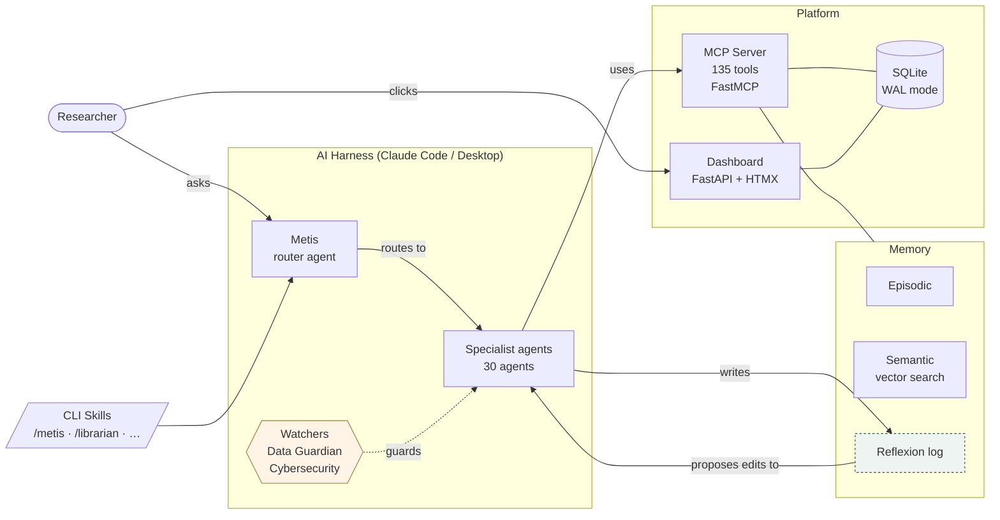

<h1 align="center">Metis — The Public Health Research Cortex</h1>

<p align="center">
  <em>AI built around researchers. Not a prompt box — a way of working.</em>
</p>

<p align="center">
<em>It's 7:20. You open the dashboard. The morning brief reads:</em>
<br><br>
<strong><em>"Two papers on HAT transmission dynamics landed overnight — one from WHO Geneva that directly challenges a working hypothesis in your field. A WHO surveillance alert flagged a new cluster in your study area. I've cross-referenced both with your knowledge graph, connected them to your meeting note from Tuesday, and flagged three passages for your review."</em></strong>
<br><br>
<em>No prompt. No setup. Your research, connected — every morning.</em>
</p>

<p align="center">
  <a href="https://github.com/SVerITG/Metis">← Metis (base)</a>
  &nbsp;&nbsp;|&nbsp;&nbsp;
  <strong>Editions:</strong>&nbsp;
  <a href="https://github.com/SVerITG/Metis_PH"><b>Metis_PH</b> — Public Health &amp; Epidemiology</a>
  &nbsp;·&nbsp;
  <a href="https://github.com/SVerITG/Metis_BM"><b>Metis_BM</b> — Biomedical Sciences <em>(Coming Soon)</em></a>
  &nbsp;·&nbsp;
  <a href="https://github.com/SVerITG/Metis_CL"><b>Metis_CL</b> — Clinical Sciences <em>(Coming Soon)</em></a>
</p>

<p align="center">
  
  <a href="https://github.com/SVerITG/Metis_PH/stargazers"></a>
  <a href="https://github.com/SVerITG/Metis_PH/blob/main/LICENSE"></a>
  
  
</p>

> **Work in progress.** The MCP server is fully operational and used daily. We are still actively developing some dashboard features, the one-click installer, and the pre-loaded public health knowledge layer. Expect rough edges. For the domain-agnostic base shell, see **[Metis](https://github.com/SVerITG/Metis)**.

> **Disclaimer.** The concept, architecture, and approach behind Metis are original. One of Metis's core principles is self-improvement — it actively monitors AI developments and incorporates new tools, skills, and agent patterns. Tools, skills, and agents were built drawing on publicly available techniques, documentation, and web resources, and as such individual components are often not unique. What Metis presents is a *way of working* — a coherent system designed for researchers. Use and extension are welcome under the AGPL-3.0 license.

---

## Vision

AI has advanced faster than most researchers can follow. The gap between what it *can* do and what a typical researcher *actually gets* from it is enormous — not because the tools are bad, but because using them well still requires technical fluency that researchers shouldn't need.

**Metis is built to close that gap.**

It was created by a public health researcher with no programming background — as a hands-on exploration of what genuine AI support looks like for research: deep literature work, long-running projects, sensitive data, and a career measured in years, not sprints. The goal is not another chat interface. It is a **research intelligence layer** that knows your field, your papers, your projects, and your working style — and that speaks plain language.

> *What if every researcher had an AI that already knew their domain, their literature, and their ongoing projects — and came pre-configured for their institution on day one?*

That is the horizon. **The current version serves individual researchers.** The longer vision: a **research institute deploying its own Metis** — an AI layer tuned to the institute's literature, data systems, and workflows, available to every staff member from day one, with data protection built in from the ground up.

### Why researchers specifically?

Generic AI tools leave several researcher-specific problems unsolved:

| Challenge | What Metis does about it |
|---|---|
| **Context amnesia** — every session starts from zero | Persistent identity card and 5-layer memory across all sessions |
| **Literature at scale** — hundreds of PDFs that need to talk to each other | Semantic PDF search (PaperQA2) + knowledge graph + cross-pollination |
| **Long-horizon projects** — research unfolds over months and years | Persistent project memory, reflexion loop, session handoffs |
| **Data sensitivity** — patient data, embargoed results, institutional ethics | Everything local. PII detection. AES-256 encryption. Constitution + red-lines. |
| **Workflow fragmentation** — literature, meetings, writing, analysis, teaching in separate tools | Single interface with 34 specialist agents across all research workflows |

---

<table width="100%" cellspacing="0" cellpadding="0" border="0">
<tr>
<td width="50%" align="center"></td>
<td width="50%" align="center"></td>
</tr>
</table>

---

## Table of Contents

- [Vision](#vision)
- [Introduction](#introduction)
- [Key Workflows](#key-workflows) — Morning · Literature · Meeting · Voice · Writing · Teaching
- [The Dashboard](#the-dashboard)
- [How Metis Knows You](#how-metis-knows-you)
- [Data Protection & Security](#data-protection--security)
- [How Metis Stays Current](#how-metis-stays-current)
- [Install](#install)
- [Future Releases](#future-releases)
- [For Developers](#for-developers)
- [Contributing](#contributing)
- [License](#license)

---

## Introduction

Every AI conversation starts from zero. No memory of your papers, your projects, or your last session. You spend ten minutes re-explaining your context — and when the window closes, it's gone.

**Metis builds a persistent research brain** underneath every AI conversation. It knows your literature, your meetings, your ideas, your open tasks. When you ask a question, the answer comes in the context of everything you're actually working on.

You talk to Metis the way you'd talk to a knowledgeable colleague. It routes to the right specialist, does the work, records the result, and comes back with a plain answer. No prompts to memorize. No settings to dig through. No technical setup required.

Metis is also built to fit *your* way of working. For example:
- **Persistent mode** — Metis is always on, reading every conversation, routing to the right specialist automatically. You just talk.
- **Laidback mode** — Step back and use the underlying AI directly. Type `/direct` for a single message, or `/metis off` to pause for the whole session. Switch back with `/metis on`.
- Want a deeper focus on a specific domain? The 13-section **config wizard** lets you tune every aspect of Metis to your field, interests, and working style — no files to edit.

### What you get on day one

| Feature | What it does |
|---|---|
| **34 specialist agents** | Librarian, Epidemiologist, Methods Coach, Writing Partner, Meeting Memory, Course Builder, Career Coach, and 25 more — each an expert in their domain |
| **Library management** | Import PDFs, sync Zotero / Mendeley, ask "what do my papers say about X?" — cited answers from your own library (PaperQA2) |
| **Live meeting assistant** | Follow along in real time, paste transcripts after, get structured notes, action items, and project cross-references automatically |
| **Morning intelligence brief** | Every morning: new papers on your exact research topics, field news, surveillance alerts, and a focus recommendation — fully personalised |
| **Voice capture & transcription** | Record anywhere, transcribe locally (faster-whisper — no API, no upload), route directly to ideas, journal, or notes |
| **Data protection & cybersecurity** | 5 security layers — PII detection, injection probes, a machine-readable constitution, non-overridable red lines, and AES-256 encryption |
| **Self-improvement loop** | Metis reviews its own performance, drafts behaviour improvements, and waits for your approval before anything changes |
| **Persistent AI identity** | A growing profile of your domain, interests, and projects — the more you use it, the better every response gets |
| **9-tab research dashboard** | Today · Knowledge · Meetings · Learning · Work · Thinking · Planner · Teach · Metis — running locally in your browser |
| **Local & private** | Everything runs on your machine. **Your data never leaves.** |

---

## Key Workflows

Metis is built around **workflows** — end-to-end sequences that span your day rather than isolated tasks.

---

### Morning Research Workflow

```
Wake up
  └─ Metis scanned overnight
       ├─ New papers on your configured research topics + field-specific RSS feeds
       ├─ WHO / surveillance alerts (configurable per domain)
       ├─ Tasks due today, overdue items, flagged threads
       └─ Suggested daily focus based on your open projects
           └─ Open dashboard → read morning brief → capture ideas → start work
```

---

### Literature Review Workflow

```
New paper (PDF / DOI / Zotero / Mendeley import)
  └─ Librarian indexes it
       ├─ Added to knowledge graph
       ├─ Cross-pollinated with existing papers, past ideas, meeting notes
       └─ Available for semantic search immediately
           └─ Ask: "What do my papers say about X?"
                └─ PaperQA2 answers with inline citations from your own library
```

---

### Live Meeting Workflow

```
Meeting starts
  ├─ Option A: paste transcript after (Teams / Zoom / audio file)
  └─ Option B: live meeting assistant — dictate observations in real time
       └─ Meeting Memory agent processes the transcript
            ├─ Structured notes with context
            ├─ Action items: who does what, by when
            ├─ Cross-references to your projects and open literature questions
            └─ Follow-up tasks auto-added to Work tab
```

---

### Writing & Thinking Workflow

```
Idea surfaces
  └─ Ctrl+K → capture instantly (i: idea · n: note · t: task · q: question)
       └─ Metis cross-pollinates immediately → related papers + past ideas surfaced
            └─ Writing Partner → draft
                 └─ Librarian → find missing sources
                      └─ Methods Coach → check the argument
```

---

### Voice Capture Workflow

```
Idea surfaces — away from your desk, mid-conversation, in the field
  ├─ Option A: record voice memo on phone → drop file in inbox/
  │       └─ transcribe_voice(audio_path="...", route_to="idea")
  └─ Option B: press Win + H anywhere on Windows → speak → text appears
       └─ Type in Claude / paste in dashboard capture box
            └─ Metis cross-pollinates + stores → nothing is lost

Research reflection (journal entry, field note)
  └─ transcribe_voice(audio_path="recording.m4a", route_to="journal")
       └─ Mood + energy auto-extracted → stored locally
```

*Voice transcription runs entirely locally using faster-whisper — no audio leaves your machine.*

---

### Teaching & Course Workflow

```
Course topic defined
  └─ Course Builder (Teach tab)
       ├─ Literature alerts: new papers relevant to your course, flagged automatically
       ├─ Generate lessons, slides, assessments, Q-bank
       ├─ Gap analysis against current literature
       └─ Spaced repetition for your own knowledge maintenance
```

---

## The Dashboard


*The Today tab — morning briefing, active project, course progress, news radar, and quick-capture in one view.*

The **9-tab dashboard** runs locally at `http://127.0.0.1:8080`. No account. No cloud. Every tab is live data from your research environment.

---

### Today — *Your morning command centre*

- **Morning briefing** — a paragraph written by Metis each day: new papers on your specific research topics, field-wide news, surveillance updates, and connections to what you were thinking about last week. Fully personalised to your configured domain and interests.
- **Task priorities** — what's due today, what's overdue, what's in progress
- **Focus suggestion** — Metis reads your open threads and recommends where to put your energy today
- **Overnight news rail** — field-specific articles from your monitored feeds, categorised by topic
- **Quick capture** (`Ctrl+K`) — add ideas, notes, tasks, or open questions without leaving the tab

---

### Knowledge — *Your entire research library, searchable and connected*

- **Semantic PDF search** — ask "what do my papers say about X?" and get cited answers (PaperQA2 powered)
- **Literature cards** — title, abstract, your annotations, citation links, domain tags, reading status
- **Domain notes** — structured notes per research area
- **Knowledge graph** — visual map of connections between papers, ideas, and topics
- **Live search** across all content types simultaneously

---

### Meetings — *Notes that think*

- **Live meeting assistant** — follow along in real time, dictate observations, get structured notes as you go
- **Transcript import** — paste from Teams, Zoom, or any audio transcript
- **Action item extraction** — who does what by when, automatically identified and tracked
- **Cross-references** — Metis links what was discussed to your open projects and literature
- **Follow-up tracking** — items automatically added to the Work tab

---

### Learning — *Know what you know. Review what you're forgetting.*

- **Courses you're taking** — progress bars, completion tracking, module structure
- **Spaced repetition** — Metis surfaces exactly what needs review today, based on forgetting curves
- **Competency map** — visual overview of your skills and knowledge gaps
- **Learning velocity stats** — how fast are you actually progressing?

---

### Work — *Tasks and projects, wired to your tools*

- **Task list** with priority levels (P1–P4), due dates, and project links
- **Project cards** — one click to open in **VS Code**, **RStudio**, or **Claude**
- **Active project tracking** — progress, recent activity, open questions per project

---

### Thinking — *Where ideas live and connect*

- **Capture anything fast** with `Ctrl+K` from anywhere in the dashboard
  - `i:` → idea · `n:` → note · `t:` → task · `q:` → open question
- **Automatic cross-pollination** — every new idea is immediately linked to related papers, past ideas, and meeting notes
- **Brainstorm launcher** — kick off a focused thinking session on any topic with one click
- **Open questions tracker** — never lose a thread

---

### Planner — *The bigger picture*

- **Kanban board** — Someday / Incubating / Active / Done
- **Research timeline** — milestones, deadlines, submission targets
- **Focus board** — major ongoing research strands laid out visually

---

### Teach — *For courses you run*

- **Literature alerts** — new papers relevant to your course topics, flagged automatically
- **Course Builder** — generate lessons, slides, assessments, and Q-banks
- **Gap analysis** — what your course is missing against current literature
- **Student-facing content** — render with Quarto

---

### Metis — *The engine room*

- **Agent run history** — every task logged with timestamp, model, token usage
- **Self-improvement proposals** — Metis drafts changes to its own behaviour; you review and approve before anything applies
- **Identity card** — your profile as Metis currently understands it
- **Agent registry** — 30 agents, their contracts, their last run
- **System health** — MCP server status, database stats, tool counts

---

## How Metis Knows You

When you first run Metis, the **config wizard** walks you through 13 topics:

> research domain · specific interests · active projects · thinking style · writing style · news monitoring topics · teaching areas · statistical methods you use · tools you work with · data sources · collaboration preferences · data sensitivity level · career context

This creates your **identity card** — a living profile that Metis reads at the start of every task to personalise how every agent responds to you.

The identity card **grows over time**. Every agent run adds context. Every idea you capture tells Metis what you're thinking about. Reflexions after each task feed a self-improvement loop that shapes responses to *you specifically*.

> A question asked after six months of use gets a meaningfully better answer than the same question on day one — not because the AI changed, but because Metis knows you better.

---

## Data Protection & Security

**Researchers handle sensitive data. Most AI tools don't take that seriously.**

Patient data, embargoed results, unpublished findings, ethics documents — these should never leave your machine. Most cloud-based AI tools have no mechanism to prevent this. Metis was designed with this problem in mind from the start.

### What stays local

Everything. The database, your PDFs, your meeting notes, your ideas, your agent history — all on your machine. The MCP server runs in a local Python process. The dashboard runs locally. Nothing is transmitted except the text you actively choose to send to Claude's API.

### Security layers

| Layer | What it does |
|---|---|
| **Pre-tool-use hook** | 12 injection patterns + domain allowlist + path restrictions — checks *every* tool call before execution |
| **PII detection** | 14 checks, 4-level classification (public / internal / confidential / restricted). **Hard block** on sensitive data reaching tools |
| **Injection probe** | Detects prompt injection attempts in external content (papers, web fetches, transcripts) before they reach the agent |
| **Constitution** | 12 machine-readable rules governing agent behaviour — applied to every deep or chained run |
| **Red lines** | 5 non-overridable rules enforced at code level — **no override possible**, even by Metis itself |
| **AES-256-GCM** | All backups encrypted at rest |
| **Ollama (optional)** | Local LLM for PII screening — sensitive documents never sent to the API at all |

### What this means for you

- Meeting notes containing patient identifiers are detected and blocked before anything reaches the API
- Embargoed draft results kept in the Thinking tab stay entirely local
- Your API key lives in a local `.env` file — never in the database, never committed to git

> The **constitution** and **red-line** system were designed specifically with institutional patient data and ethics compliance in mind. This is not an afterthought — it is architecture.

---

## How Metis Stays Current

Metis doesn't just run tasks — it **reflects on them** and improves over time.

After every substantive agent run:

1. **`write_reflexion()`** logs what went well, what could improve, and what was missing
2. **Weekly:** `aggregate_reflexions()` extracts themes across all runs (Claude Haiku)
3. **`draft_self_improvement_proposal()`** writes a proposed change to the agent's behaviour, with rationale
4. **You review it in the Metis tab** — approve, reject, or edit before anything changes
5. **`apply_proposal()`** writes the update to disk with a timestamped backup

No change to agent behaviour ever happens without your review. The system proposes; you decide.

---

## Install

### For Researchers — Windows one-click installer

No terminal. No Python. No technical knowledge needed. Download, double-click, answer three questions.

> **[Download the latest MetisSetup.exe →](https://github.com/SVerITG/Metis_PH/releases/latest)**

Four installer variants — choose what fits your work:

| Installer | Includes | Best for |
|---|---|---|
| **Full** | AI assistant + dashboard + RStudio launcher + MLM statistics course | Everything, from day one |
| **Full without course** | AI assistant + dashboard + RStudio launcher | Full Metis, add courses later |
| **Full without RStudio** | AI assistant + dashboard (no R integration) | Non-R researchers |
| **MCP only** | AI assistant in Claude Desktop only — no dashboard, no R | Background file organisation, lightest footprint |

All variants install Claude Desktop, configure Metis automatically, and launch the **13-section config wizard** on first open. Takes about 8 minutes.

**Requirements:** Windows 10 or 11 · Internet connection · [Anthropic API key](https://console.anthropic.com)

---

### For Researchers — manual Windows install

If the `.exe` doesn't work (corporate machines, restricted policies), run the PowerShell script directly:

```
metis/system/install/windows/install.bat
```

---

### For Developers — Linux / WSL / macOS

```bash
bash <(curl -fsSL https://raw.githubusercontent.com/SVerITG/Metis_PH/main/metis/system/mcp-server/setup-mcp.sh)
```

Gives you all **34 agents** and **76+ tools** inside Claude Desktop or Claude Code. Idempotent. Dashboard:

```bash
cd ~/Metis_PH/metis/system/app-py && bash run.sh   # → http://127.0.0.1:8080
```

Run the **config wizard** from the Metis tab to personalise your installation.

---

# Future Releases

Metis will ship in distinct editions, each with its own GitHub repository. The base (`Metis`) is a domain-agnostic shell; domain packs add the field-specific layer on top.

| Repository | Status | What it is |
|---|---|---|
| **[Metis](https://github.com/SVerITG/Metis)** | ▶ Live (v1.0) | Research Cortex shell — full architecture, no domain content. Clone this to build your own edition. |
| **[Metis_PH](https://github.com/SVerITG/Metis_PH)** | ▶ Current (this repo, v1.0) | Public Health & Epidemiology edition — MCP server operational, knowledge layer actively being built |
| **Metis_PH v1.0** | ✅ Released | Stable release — see [release notes](system/config/release-notes-v1.0.md) |
| **[Metis_BM](https://github.com/SVerITG/Metis_BM)** | 🧬 Placeholder | Biomedical Sciences — to be built |
| **[Metis_CL](https://github.com/SVerITG/Metis_CL)** | 🏥 Placeholder | Clinical Sciences — to be built |
| **Metis [Domain]** | 🌍 Community | Domain packs for other research fields as contributed |
| **Metis Institute Edition** | 🏛 Future | Multi-user, shared knowledge base, institutional deployment |

Each domain edition includes: pre-configured **journals + RSS feeds**, **specialist agents**, a **domain ontology**, and a curated **knowledge library** for that field.

The **Metis base** (`Metis`) ships the full architecture — MCP server, dashboard, 5-layer memory, self-improvement loop — with no domain-specific content loaded. For developers and institutions building from scratch.

> **Want to build a domain pack?** Start from `Metis`, add your field's knowledge library, agents, and RSS feeds, and open a PR or publish your own fork.

---

# For Developers

*This section assumes familiarity with Python, Git, and the command line.*

---

## Architecture



---

## Stack

| Layer | Technology |
|---|---|
| AI harness | Claude Code, Claude Desktop (primary); Gemini (experimental) |
| MCP server | Python 3.10+, FastMCP, runs in WSL venv |
| Dashboard | FastAPI + HTMX + Jinja2, no JavaScript framework |
| Database | SQLite WAL mode, 46 tables |
| Vector memory | sqlite-vec + nomic-embed-text-v1.5-Q (768 dims, local ONNX) |
| Semantic PDF search | PaperQA2 (FutureHouse) — indexes PDF library, answers with citations |
| Host OS | Windows + WSL2 (Ubuntu 20/22/24) |
| File sync | OneDrive / Dropbox (optional, transparent) |

---

## Under the Hood

**Memory (5 layers)**

| Layer | What it stores |
|---|---|
| Episodic | Session events and observations (discovery · decision · implementation · issue) |
| Semantic | Vector-indexed content (sqlite-vec + nomic-embed-text-v1.5-Q, 768 dims) |
| Procedural | Skill files and agent contracts — the agent's persistent behaviour |
| Working | Active session context and current project focus |
| Reflexive | Reflexion log and improvement proposals |

**Self-improvement loop**
1. After every deep run: `write_reflexion()` logs what went well, what could improve, what was missing
2. Weekly: `aggregate_reflexions()` extracts themes via Claude Haiku
3. `draft_self_improvement_proposal()` writes a proposed `skill.md` edit with rationale
4. You review in the Metis tab → `apply_proposal()` writes to disk with timestamped backup

**Security layers (detail)**
1. `pre-tool-use.mjs` — 12 injection patterns, domain allowlist, path restrictions (every tool call)
2. `guardrails.py` — injection probe on all external content
3. `safety.py` — 14 PII checks, 4-level classification, hard block on sensitive data
4. `constitution.md` — 12 machine-readable rules for deep/chain runs
5. `red-lines.md` — 5 non-overridable rules enforced at code level

**Token efficiency**
- Model routing: Haiku for summaries, Sonnet for most work, Opus for deep reasoning
- Surgical context assembly per agent — not full history on every call
- Max-turns guardrail (stops at 20, prompts `/clear`)
- Handoff brief at session end (< 3 KB state capture for next session)

---

## Installation Options

### Option 1 — Single command (Linux, macOS, WSL)

```bash
bash <(curl -fsSL https://raw.githubusercontent.com/SVerITG/Metis_PH/main/metis/system/mcp-server/setup-mcp.sh)
```

Detects Ubuntu 20/22/24, Debian, macOS (Homebrew). Creates venv, installs all dependencies, registers with Claude Code and Claude Desktop. Idempotent — safe to re-run.

### Option 2 — WSL on Windows (recommended for developers on Windows)

Open **Windows Terminal → Ubuntu** (or any WSL distro) and run:

```bash
# 1. Clone
git clone https://github.com/SVerITG/Metis_PH.git ~/Metis_PH

# 2. Install MCP server + register with Claude Code and Claude Desktop
cd ~/Metis_PH/metis/system/mcp-server && bash setup-mcp.sh

# 3. Start the dashboard
cd ~/Metis_PH/metis/system/app-py && bash run.sh
# → http://127.0.0.1:8080
```

Claude Desktop on Windows picks up the WSL MCP server automatically via `wsl.exe` — see [Register with Claude Desktop](#register-with-claude-desktop-windows--wsl) below.

### Option 3 — Manual (any platform)

```bash
git clone https://github.com/SVerITG/Metis_PH.git
cd Metis_PH/metis/system/mcp-server
python3 -m venv .venv && source .venv/bin/activate
pip install -e ".[voice]"

# Set env vars and start
export METIS_RC_ROOT="$(pwd)/../../.."
export ANTHROPIC_API_KEY="sk-ant-..."

# MCP server (register path in Claude settings)
python -m metis_mcp.server

# Dashboard (separate terminal)
cd ../app-py && pip install -r requirements.txt
uvicorn main:app --host 127.0.0.1 --port 8080
# → http://127.0.0.1:8080
```

### Option 4 — Docker

```bash
# Copy env file and fill in your API key + data directory
cp metis/system/install/docker/.env.example metis/system/install/docker/.env

# Full: MCP server + dashboard
docker compose -f metis/system/install/docker/docker-compose.yml up -d
# → http://localhost:8080

# Light: MCP tools only (no dashboard, for Claude Desktop only)
docker compose -f metis/system/install/docker/docker-compose.light.yml up -d
```

For the MCP-only Docker image, point Claude Desktop at the container — see `.env.example` for the config snippet.

### Option 5 — Windows .exe installer

No terminal. No Python. Download, double-click, answer three questions.

> **[Download the latest MetisSetup.exe →](https://github.com/SVerITG/Metis_PH/releases/latest)**

Four variants (Full / PH Shell / Standard / MCP-only) — all install Claude Desktop and launch the config wizard on first run.

---

## Register with Claude Code

`~/.claude/settings.json`:
```json
{
  "mcpServers": {
    "metis-rc": {
      "command": "/home/<username>/.local/share/metis-mcp/run.sh"
    }
  }
}
```

## Register with Claude Desktop (Windows + WSL)

`%APPDATA%\Claude\claude_desktop_config.json`:
```json
{
  "mcpServers": {
    "metis-rc": {
      "command": "wsl.exe",
      "args": ["-e", "bash", "/home/<username>/.local/share/metis-mcp/run.sh"]
    }
  }
}
```

---

## Configuration

| File | Controls |
|---|---|
| `system/config/user-config.yaml` | Domain, interests, thinking style, preferences — generated by config wizard |
| `system/config/constitution.md` | 12 rules applied to every deep/chain agent run |
| `system/config/red-lines.md` | 5 non-overridable rules (sensitive data, API keys, etc.) |
| `system/config/token-guardrails.md` | Model routing per agent, handoff thresholds |
| `agents/<name>/skill.md` | Behavioural contract for each agent — directly editable |
| `.claude/hooks/pre-tool-use.mjs` | Security gate on all tool calls |

---

## Dependencies

**Python packages (auto-installed):**

| Package | Purpose |
|---|---|
| `mcp`, `fastmcp` | MCP protocol |
| `fastapi`, `uvicorn`, `starlette` | Dashboard |
| `sqlite-vec` | Local vector search |
| `fastembed` | nomic-embed-text-v1.5-Q embeddings (768 dims, ONNX) |
| `paper-qa` | PaperQA2 semantic PDF search |
| `feedparser` | RSS feed parsing |
| `pyyaml` | User config |
| `httpx` | Async HTTP |
| `pandas`, `openpyxl`, `pyreadstat` | Data analyst (CSV/Excel/SPSS/Stata) |
| `cryptography` | AES-256-GCM backup encryption |
| `pyzotero` | Zotero sync |
| `bibtexparser` | Mendeley BibTeX import |
| `twilio` | WhatsApp capture webhook (optional) |

**External tools:**

| Tool | Required for |
|---|---|
| WSL + Ubuntu | Everything on Windows |
| Claude Desktop or Claude Code | AI harness |
| R + RStudio | R statistical analysis |
| Quarto | Course Builder (lesson rendering) |
| Zotero | Reference manager sync |
| Ollama (optional) | Local LLM for offline PII screening |

---

## Cross-AI / Harness Support

| Harness | Status |
|---|---|
| Claude Code | ✅ Primary — full support (MCP + skills + hooks) |
| Claude Desktop | ✅ Primary — full MCP + memory; no CLI skills |
| Gemini 2.0+ | 🔬 Experimental |
| OpenAI Codex / Cursor | 🟡 Partial — MCP tools only |

---

## Project Status

**Completed:** Phases 0–9b — foundations · 9-tab dashboard · 30 agents · CLI skills · 5-layer memory · knowledge graph · self-improvement loop · token efficiency · Zotero/Mendeley · meeting assistant · PaperQA2 PDF search · cross-pollination

**In progress:** Phase 10 (automated daily tasks) · Phase 11 (.exe installer) · Phase 12 (test suite)

---

# Contributing

Metis is designed to grow beyond one domain and one researcher. Contributions are welcome — especially from researchers who use it and know what's missing.

See [CONTRIBUTING.md](metis/CONTRIBUTING.md) for guidelines.

### Domain packs for other fields

The most impactful contribution. A domain pack adds field-specific knowledge to the empty Metis shell:
key journals + RSS feeds, specialist agents, a domain ontology, and a curated background library.
The Public Health edition ships as the reference implementation.

**Wanted:** Biomedical Sciences · Clinical Sciences · Social Sciences · Environmental Science ·
Economics · Psychology · Education · Law and Policy · Nursing and Allied Health

### Metis in other languages

The agent prompts, wizard, and dashboard are currently English-only. Translations of the
config wizard and skill files into French, Dutch, Spanish, German, and other languages
would make Metis accessible to many more researchers.

### Verification of installer files

The Windows `.exe` and PowerShell installers need testing across different Windows 10/11
configurations, corporate environments (managed machines, restricted policies), and hardware.
Reports of what breaks and what works are very valuable.

### Tools and skills for Metis

New specialist agents, improved behavioural contracts, or workflow skills for use cases
not yet covered. The agent model is designed to be extended without touching core code.

### Multi-AI usage

Metis currently targets Claude as primary harness. Contributions that improve support for
Gemini (experimental today), OpenAI Codex, or local models (Ollama) are welcome —
especially for offline / air-gapped research environments.

### Data protection and cybersecurity verification

Privacy and security are **core promises** of Metis, not features. Independent verification
of the local-first guarantees, PII detection coverage, hook behaviour, and constitution
enforcement is actively sought. This includes:
- Confirming what data reaches the API under normal and edge-case usage
- Red-teaming the injection probe and pre-tool-use hook
- Verifying AES-256 backup encryption
- Reviewing the constitution and red-lines for gaps

If you find a privacy or security issue, please open a private issue or contact the maintainer directly.

### General suggestions

Bug reports, UX feedback, and feature ideas from researchers using Metis in the field are
the most valuable input of all. If something doesn't work for your workflow, say so.

---

### Domain Packs (Most Wanted)

A domain pack consists of: key journals + RSS feeds, specialist agents or skill overlays, a domain ontology, and PubMed/OpenAlex query templates.

| Domain | Status |
|---|---|
| **Public Health & Epidemiology** | ✅ Included |
| Social Sciences | 🔬 Planned |
| Biomedical Sciences / Clinical Research | 🔬 Planned |
| Economics and Development Economics | 🔬 Planned |
| Environmental Science and Climate | 🔬 Planned |
| Psychology and Behavioral Sciences | 🔬 Planned |
| Law and Policy | 🔬 Planned |
| Education Research | 🔬 Planned |
| Nursing and Allied Health | 🔬 Planned |

---

### Infrastructure Contributions

- ~~nomic-embed-text-v1.5-Q cross-pollination~~ ✅ Done
- ~~PaperQA2 semantic PDF search~~ ✅ Done
- ~~Mobile PWA capture page~~ ✅ Done
- ~~Domain-specific tool loading~~ ✅ Done (`METIS_AGENT_SUBSET`)
- Telegram bot for mobile idea capture — **wanted**
- Test suite (unit + integration + e2e) — **wanted**
- Windows `.exe` installer — in progress

---

# License

MIT for the codebase. CC-BY-SA for course content and learning materials.

*LICENSE file ships with v1.0.*
