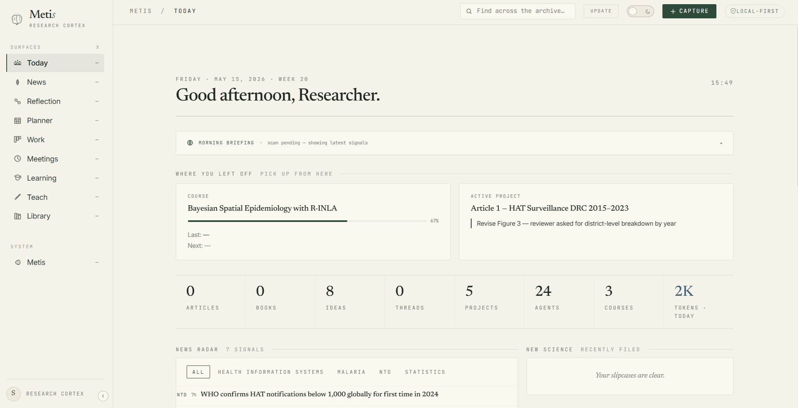
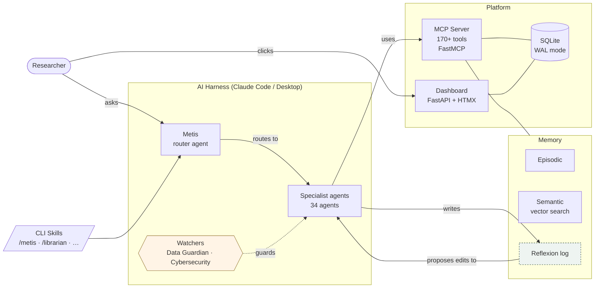

<p align="center">
  <picture>
    <source media="(prefers-color-scheme: dark)" srcset="Metis_github.png"/>
    
  </picture>
</p>

<h1 align="center">Metis — The Research Cortex</h1>

<p align="center">
  <em>AI built around researchers. Not a prompt box — a way of working.</em><br>
  <em>Your papers, meetings, ideas, notes and journal — each one linked to the rest.</em><br>
  <em>A research companion that reviews its own work and gets sharper every week.</em>
</p>

<p align="center">
<em>It's 7:20. You open the dashboard. The morning brief reads:</em>
<br><br>
<strong><em>"Three papers matching your configured topics landed overnight — one directly challenges a working hypothesis in your field. Your literature coverage in methods has grown to 84%. I've cross-referenced all three with your knowledge graph, connected them to your meeting note from Tuesday, and flagged four passages for your review. One tracked analysis is approaching a key deadline."</em></strong>
<br><br>
<em>No prompt. No setup. Your research, connected — every morning.</em>
</p>

<br>

<table width="100%" cellspacing="0" cellpadding="16" border="0">
<tr>
<td width="33%" valign="top" align="center">
<p><strong>☁️ Light</strong><br><em>MCP server only</em></p>
<p><em>You ask Claude to build a monitoring dashboard for your Leishmaniasis project. Metis recalls the surveillance tool you built eighteen months ago, your preferred layout, and your standard epidemiological indicators. The Epidemiology Agent and Dashboard Maker deliver exactly what you need — in your style, to your domain standards — without any re-explaining.</em></p>
</td>
<td width="33%" valign="top" align="center">
<p><strong>🔗 Cross-pollination</strong><br><em>The moment everything connects</em></p>
<p><em>You capture a quick idea about a novel surveillance approach. Within seconds, Metis surfaces three things you'd forgotten existed: a methodology paper from fourteen months ago that used a similar approach, a meeting note from March where your field partner described the same barrier, and an open question you logged after a conference. You hadn't connected any of it. Metis did. The grant section writes itself.</em></p>
</td>
<td width="33%" valign="top" align="center">
<p><strong>🌐 Metis OS</strong><br><em>The full picture — in development</em></p>
<p><em>Your calendar shows a meeting with a Lepra diagnostics colleague. Yesterday you captured an idea about rapid field tests. Metis has your April transcript with this person and this week's new papers. A briefing appears before you leave. After the meeting, you ask for a five-day course on Lepra diagnostics from the latest research. By evening, it's ready.</em></p>
</td>
</tr>
</table>

<br>

<p align="center">
  <strong>Editions:</strong>&nbsp;
  <a href="https://github.com/SVerITG/Metis"><b>Metis</b> — Base shell</a>
  &nbsp;·&nbsp;
  <a href="https://github.com/SVerITG/Metis_PH"><b>Metis_PH</b> — Public Health &amp; Epidemiology</a>
  &nbsp;·&nbsp;
  <a href="https://github.com/SVerITG/Metis_BM"><b>Metis_BM</b> — Biomedical Sciences <em>(coming soon)</em></a>
  &nbsp;·&nbsp;
  <a href="https://github.com/SVerITG/Metis_CL"><b>Metis_CL</b> — Clinical Sciences <em>(coming soon)</em></a>
</p>

<p align="center">
  
  <a href="https://github.com/SVerITG/Metis_PH/stargazers"></a>
  
  <a href="https://github.com/SVerITG/Metis_PH/blob/main/LICENSE"></a>
  
  
  
</p>

---

## Why researchers trust it

- **📚 It cites your own sources.** Every knowledge answer is drawn from *your* indexed library, with document- and page-level citations — not the model's guesses.
- **🔗 It connects everything you know.** Every paper, meeting transcript, idea, note, journal entry and task is linked to the rest of your work. The grant you write today surfaces a method paper from last year and a meeting note from March — you never go looking; Metis brings it to you.
- **🧠 It routes to the right expert.** Ask in plain language, and Metis hands the work to the right one of 30+ specialist skills — Librarian, Methods Coach, Writing Partner, Meeting Memory, Epidemiologist, Course Builder, and more.
- **🔁 It improves itself.** After every task it logs what worked and what fell short; each week it drafts improvements to its own behaviour and waits for your approval. Most MCP servers are static — Metis gets sharper the longer you use it.
- **🚫 It refuses to invent.** Ask about something that isn't in your library and Metis tells you so, instead of fabricating a plausible-sounding answer. (This grounding behaviour is covered by an automated test.)
- **🔒 It stays on your machine.** Local embeddings, local database, local files. Your papers, patient-adjacent data, and unpublished work never leave your computer.

> 🎥 **See it in two minutes** — *(demo coming)* watch Metis answer from a real WHO source with page citations, then refuse to summarise a protocol that doesn't exist.
> <!-- TODO: replace with demo GIF/video, e.g.  -->

**Easiest way to try it:** install [Claude Desktop](https://claude.ai/download) and run the [3-step setup](#for-researchers) — a demo workspace is pre-loaded, so you start with something to explore instead of a blank screen.

---

## Who is this for?

<table width="100%" cellspacing="0" cellpadding="20" border="0">
<tr>
<td width="50%" valign="top" align="center">

### 🔬 I'm a researcher

No programming background needed. Install in minutes, start working immediately. Everything Metis does is explained in plain language.

**→ [Get started (3 steps)](#for-researchers)**

</td>
<td width="50%" valign="top" align="center">

### ⚙️ I'm a developer

Open-source, extensible, well-architected. Build domain packs, add agents, extend the MCP server, or deploy for your institution.

**→ [Explore the architecture](#for-developers)**

</td>
</tr>
</table>

---

## What is Metis?

Metis is a **local AI research companion** built on top of Claude. It gives every AI conversation a persistent memory of your domain, your papers, your projects, and your working history. It routes your requests to the right specialist, does the work, records the result, and returns a plain answer — without requiring you to prompt or configure anything.

It runs entirely on your machine. Your data never leaves.

**The short version:** imagine an AI that already knew your field and your literature, connected every paper, meeting, idea and note you've captured, sent each request to the right specialist — and got sharper about your work, *and about itself*, the longer you used it. That's Metis.

---

## How it works

Metis is **not a separate app you log into.** It's a small service that runs quietly in the background and connects Claude to your research — your papers, your memory, your projects.

1. **A background service** (the "MCP server") starts with your computer. It's the bridge between Claude and your files — you never interact with it directly.
2. **You talk to Metis through Claude**, two ways:
   - **Claude Desktop** (easiest): open it and pick a **Metis prompt** (e.g. *Metis*, *Metis Doctor*) from the prompt menu — or just ask.
   - **Claude Code** (terminal): type **`/metis`** followed by your request.
3. **You ask in plain language.** Metis works out which of its 34 specialists should handle it, does the work using *your* library and memory, and answers — citing sources.

That's it. There's nothing to learn before you start; the dashboard is optional visibility *on top* of all this.

---

## Design Philosophy

Every AI conversation starts from zero. You spend ten minutes re-explaining your context, and when the session ends, it's gone. Generic AI tools are powerful but stateless — they know everything about the world and nothing about you.

**Metis is built on one idea: the AI should know you. And it should keep getting better — on its own.**

Not just your name — your domain, your literature, your projects, your preferred working style, your open questions, your meeting notes from last month, and the paper you added to your library yesterday. The longer you use Metis, the better every response gets. Not because the AI changes — because Metis knows you better.

**You don't need to follow developments in AI.** Metis does that for you. Every week, Metis reviews its own performance across all your sessions, identifies where it could have done better, drafts improvements to its own behaviour, and waits for your approval before applying them. As better methods and models become available, those improvements are folded in the same way — always proposed for your approval, never applied behind your back. As a researcher, you focus on your research. Metis handles keeping itself sharp.

**The core mechanism is cross-pollination.** Every time you capture an idea, add a paper, record a meeting, or complete a task, Metis connects it to everything else in your research universe. A paper you indexed a year ago surfaces when you're writing a grant today. A meeting note from March links to the idea you captured this morning. An open question from six months ago connects to a new paper that just came out. These connections happen automatically, in the background, without you having to search for them. This is what makes Metis a *research companion* rather than a search tool — it thinks across your entire body of work so you don't have to hold it all in your head.

This is genuinely new ground. The individual components — local language models, retrieval-augmented generation, agent routing, vector search — all exist independently. What Metis presents is a coherent integration of all of them, purpose-built for the specific demands of research work: long timelines, sensitive data, deep literature, and knowledge that accumulates over years. A system that grows *with* you, and surfaces connections *for* you — rather than starting from zero every session. To our knowledge, nothing quite like this exists as a unified, locally-running, researcher-facing system.

### Three levels — choose your entry point

| Level | What it is | Best for |
|---|---|---|
| **☁️ MCP server only** | A background service that runs alongside Claude. Persistent memory, session awareness, 34 specialist agents — no dashboard, no visible app. | Researchers who use Claude already and want it to know their work |
| **📊 With the dashboard** | Full visibility across your research life — papers, ideas, meetings, tasks, projects, all connected. Built for *cross-pollination* (ideas linking to literature) and *brain off-loading* (tracking leaving your head, entering the system). | Researchers who want a complete research operating environment |
| **🌐 Metis OS** | Connects to email, calendar, data systems, and institutional infrastructure — a unified intelligence layer for your entire working environment. | The longer vision. Still in development. |

> **Where things stand today:** The MCP server, 34 agents, and the 9-tab dashboard are fully operational and used daily. The one-click installer and the pre-loaded domain knowledge layer are still being refined. This is a working system — not vaporware — but it is also not finished. If something breaks, please open an issue. That feedback shapes what gets built next.

---

## For Researchers

*No programming background needed. Everything below is point-and-click or copy-paste.*

---

### Install in 3 steps

> **Step 1 — Get your Anthropic API key (free, 2 minutes)**
>
> 1. Go to **[console.anthropic.com](https://console.anthropic.com)** and create an account.
> 2. Click **API Keys → Create Key**. Copy the key (it starts with `sk-ant-…`).
> 3. Keep that tab open — the installer will ask for it once.
>
> The key stays on your computer. It is never uploaded or shared.

---

**Windows**

> **[⬇ Download MetisSetup.exe](https://github.com/SVerITG/Metis_PH/releases/latest)**

Double-click the installer. The wizard walks you through:
1. **Full or AI only** — Full gives you the AI assistant + 9-tab research dashboard (~15 min). AI only is faster (~5 min) and you can add the dashboard later.
2. **Your projects** — Tell Metis what you're working on. It creates a tracking record for each project, writes a context file into the project folder, and registers it in Claude Desktop automatically.
3. **Demo workspace** — Pre-loads realistic example projects, meetings, literature, and tasks so you can explore every feature immediately. Recommended for first-time users.
4. **API key** — Paste it once.

Everything else is automatic. Claude Desktop opens at the end with Metis ready to go.

*Requirements: Windows 10 or 11 · Internet connection · [API key](https://console.anthropic.com)*

---

**macOS or Linux**

Open Terminal and paste:

```bash
bash <(curl -fsSL https://raw.githubusercontent.com/SVerITG/Metis_PH/main/system/mcp-server/setup-mcp.sh)
```

The script asks two questions (Full or AI only, demo workspace) and does the rest. Registers Metis with Claude Desktop and Claude Code automatically. Works on Ubuntu 20/22/24, Debian, and macOS.

---

### What you get on day one

| Feature | What it does |
|---|---|
| **34 specialist agents** | Librarian, Epidemiologist, Methods Coach, Writing Partner, Meeting Memory, Course Builder, Career Coach, Critic, and 26 more — each an expert in their domain |
| **Grounded answers** | Every knowledge question is automatically answered from your own indexed document library with page-level citations — not AI guesses |
| **Library management** | Import PDFs, sync Zotero or Mendeley, ask "what do my papers say about X?" — cited answers from your own library |
| **Morning intelligence brief** | Every morning: new papers on your exact research topics, field news, surveillance alerts, and a focus recommendation — fully personalised |
| **Live meeting assistant** | Follow along in real time, or paste a transcript — get structured notes, action items, and project cross-references automatically |
| **Project tracking** | Every project gets a tracking record, a context file in its folder, and integration with Claude Desktop. The Update button scans all your project folders for activity. |
| **Voice capture** | Record anywhere, transcribe locally (no API, no upload), route to ideas, journal, or notes |
| **9-tab dashboard** | Today · Knowledge · Meetings · Learning · Work · Thinking · Planner · Teach · Metis — all live, all local |
| **Data protection** | Five security layers. Patient data and embargoed results are detected and blocked before anything reaches the AI. Everything runs on your machine. |
| **Cross-pollination** | Every idea, paper, meeting, and task is automatically connected to everything else in your research universe. Metis surfaces links across time — a paper from last year, a meeting note from March, a question you logged at a conference — without you searching for any of it. |
| **Token tracking** | Every agent run shows exactly what it cost — which specialist was used, how many tokens, what model. The dashboard Today tab has a live token pulse so you always know your daily usage. Most daily tasks stay under a few cents. |
| **Tool subset loading** | Metis registers 170+ MCP tools, but exposing all of them to Claude on every session wastes context. By default, Metis loads only the tools relevant to the current agent — 90 tools for News Radar, 107 for the Librarian, ~65 for a general session. Each tool definition costs tokens; loading fewer means more room for actual work and lower per-session cost. Disable with `METIS_TOOL_SUBSETS=0` to see all tools. |
| **Metis evolves — you don't have to** | Every week, Metis reviews its own session logs, identifies where it underperformed, and drafts behaviour improvements. You approve or reject them — nothing changes without your sign-off. New capabilities are folded in the same way. You focus on your research; Metis keeps itself sharp. |
| **Grows with you** | Every agent run adds to your profile. A question asked after six months of use gets a meaningfully better answer than the same question on day one — not because the AI changed, but because Metis knows you better. |

---

### Key Workflows

---

**Morning**

```
Wake up
  └─ Metis scanned overnight
       ├─ New papers on your configured research topics
       ├─ Surveillance alerts and field news
       ├─ Tasks due today, overdue items
       └─ Suggested daily focus based on your open projects
           └─ Open dashboard → read morning brief → start work
```

---

**Literature**

```
New paper (PDF / DOI / Zotero / Mendeley import)
  └─ Librarian indexes it
       ├─ Added to knowledge graph
       ├─ Cross-pollinated with existing papers, past ideas, meeting notes
       └─ Available for cited semantic search immediately
           └─ Ask: "What do my papers say about X?"
                └─ Answered with inline citations from your own library
```

---

**Meetings**

```
Meeting ends
  ├─ Paste transcript (Teams / Zoom / any audio file)
  └─ Meeting Memory agent processes it
       ├─ Structured notes with context
       ├─ Action items: who does what, by when
       ├─ Cross-references to your projects and open questions
       └─ Follow-up tasks auto-added to Work tab
```

---

**Ideas and writing**

```
Idea surfaces
  └─ Ctrl+K → capture instantly (i: idea · n: note · t: task · q: question)
       └─ Metis cross-pollinates immediately
            └─ Related papers + past ideas surfaced automatically
                 └─ Writing Partner → draft · Librarian → sources · Methods Coach → check argument
```

---

**Teaching and courses**

```
Course topic defined
  └─ Course Builder
       ├─ Generates lessons, slides, assessments, question banks
       ├─ Flags new papers relevant to your course automatically
       ├─ Gap analysis against current literature
       └─ Spaced repetition for your own knowledge maintenance
```

---

### The Dashboard

The **9-tab dashboard** runs locally at `http://127.0.0.1:8080`. No account, no cloud, no subscription.



*The Today tab — morning briefing, active project, progress, news radar, and quick stats. Everything personalised to your research domain.*

---

| Tab | What it does |
|---|---|
| **Today** | Morning brief, priority task queue, news rail, quick capture (`Ctrl+K`) |
| **Knowledge** | Semantic PDF search, literature cards, knowledge graph, coverage gap analysis |
| **Meetings** | Live assistant, transcript import, action items, cross-references |
| **Learning** | Course progress, spaced repetition, competency map |
| **Work** | Tasks, project cards, activity tracking, one-click open in VS Code / RStudio / Claude |
| **Thinking** | Idea capture, cross-pollination, brainstorm launcher, open questions tracker |
| **Planner** | Kanban board, research timeline, milestones |
| **Teach** | Course Builder, literature alerts, lesson generation, student-facing content |
| **Metis** | Agent run history, self-improvement proposals, system health, identity card |

---

### How Metis Knows You

When you first install Metis, a **setup wizard** walks you through your profile:

> research domain · specific interests · active projects · working style · tools you use · data sensitivity level

This creates your **identity card** — a living profile that every agent reads before responding to you. It grows over time. Every session adds context. Every idea you capture tells Metis what you're thinking about.

> A question asked after six months of use gets a meaningfully better answer than the same question on day one — not because the AI changed, but because Metis knows you better.

---

### Data Protection

**Researchers handle sensitive data. Most AI tools don't take that seriously.**

Patient data, embargoed results, unpublished findings — these should never leave your machine. Metis was designed with this in mind from the start.

**What leaves your machine (and when):**

| Service | What | When | Optional? |
|---|---|---|---|
| **Anthropic Claude API** | Text you send for analysis | On demand | Required for AI |
| **PubMed / OpenAlex** | Your research search keywords | Daily morning scan | Yes |
| **Zotero** | Library metadata (titles, abstracts, tags) | Daily sync | Yes |
| **CrossRef** | DOI queries | On demand | Yes |
| **HuggingFace** | Model name only — downloads embedding models | First run | Yes |

Everything else — your documents, voice recordings, PDF text, meeting notes, patient-adjacent data — stays on disk.

**Security layers:**

| Layer | What it does |
|---|---|
| **Pre-tool hook** | Checks every tool call for injection attempts and restricted paths |
| **PII detection** | 11 checks, 4-level classification. Sensitive data is classified and refused at pipeline entry |
| **Injection probe** | Detects prompt injection in external content (papers, transcripts) |
| **Constitution** | 14 machine-readable rules applied to every deep agent run |
| **Red lines** | 5 non-overridable rules enforced at code level — no override possible |
| **AES-256 encryption** | All backups encrypted at rest |

---

### How Metis Stays Current — So You Don't Have To

AI is moving fast. New models, new capabilities, new research tools appear every month. Most researchers don't have time to follow it. **Metis is designed to handle this for you.**

After every agent run, Metis logs a reflexion — what went well, what fell short, what context was missing. Every week it aggregates these into themes. Every week it drafts behaviour improvements with a clear rationale. You review the proposals in the Metis tab — one click to approve, reject, or edit — and the approved changes are written to disk.

This means Metis gets better at working *with you specifically*, week after week. It also means that as new AI developments become available and get integrated into Metis, you receive the improvements without having to do anything. **Your job is your research. Metis's job is to stay sharp.**

The self-improvement loop in detail:
1. **After every agent run** — reflexion logged: what went well, what could improve, what was missing
2. **Weekly** — themes extracted across all sessions; patterns identified
3. **Proposal drafted** — a concrete proposed change to agent behaviour, with reasoning
4. **You review** in the Metis tab — approve, reject, or edit before anything applies
5. **Applied with backup** — the update is written with a timestamped rollback point

No change to Metis's behaviour ever happens without your explicit approval. The system proposes; you decide.

---

## For Developers

*This section assumes familiarity with Python, Git, and the command line.*

---

### Architecture



---

### Stack

| Layer | Technology |
|---|---|
| AI harness | Claude Code, Claude Desktop (primary); Gemini (experimental) |
| MCP server | Python 3.10+, FastMCP, runs in local venv |
| Dashboard | FastAPI + HTMX + Jinja2 — no JavaScript framework |
| Database | SQLite WAL mode, 46 tables |
| Vector memory | sqlite-vec + nomic-embed-text-v1.5-Q (768 dims, local ONNX) |
| Semantic PDF search | sqlite-vec — local PDF chunk index, no external API |
| Host OS | Windows + WSL2 (Ubuntu 20/22/24) · macOS · Linux |

---

### Memory — 5 layers

| Layer | What it stores |
|---|---|
| Episodic | Session events and observations (discovery · decision · implementation · issue) |
| Semantic | Vector-indexed content (sqlite-vec + nomic-embed-text-v1.5-Q, 768 dims) |
| Procedural | Skill files and agent contracts — the agent's persistent behaviour |
| Working | Active session context and current project focus |
| Reflexive | Reflexion log and improvement proposals |

---

### Knowledge Layer & Grounded Answers (RAG)

When you ask a knowledge-intensive question, Metis retrieves relevant passages from your indexed document library *before* the specialist agent answers. The agent grounds its response in what it can read from your library — not only what it was trained to recall.

```
You ask Methods Coach:
"Which variance estimator should I use for my Poisson MLM with overdispersion?"

Metis retrieves before routing:
  → Leyland (2020) Multilevel Modelling for Public Health, p.142 — score 0.87
  → Bates lme4 vignette, p.28 — score 0.71

Methods Coach answers grounded in those passages, citing both sources.
```

| Component | Details |
|---|---|
| Embedding model | `nomic-embed-text-v1.5-Q` — 768-dim, ONNX, fully local |
| Vector store | `sqlite-vec` virtual table inside Metis SQLite database |
| Chunking | 3,200-character chunks, 400-character overlap |
| Score threshold | Chunks below 0.4 similarity dropped before injection |

**Pre-loaded knowledge layers (Metis_PH):**

| Layer | Documents | Covers |
|---|---|---|
| **Public Health Background** | 34 | WHO guidelines, global health reports, social determinants, NCDs, maternal & child health |
| **Epidemiology & Methods** | 10 | STROBE, WHO Basic Epi, Leyland MLM, Bates lme4, PRISMA 2020, SaTScan, CIFOR |

---

### Security Layers (detail)

1. `pre-tool-use.mjs` — 13 injection patterns, domain allowlist, path restrictions (every tool call)
2. `guardrails.py` — injection probe on all external content (papers, web, transcripts)
3. `safety.py` — 11 PII checks, 4-level classification, sensitive data refused at pipeline entry
4. `constitution.md` — 14 machine-readable rules for deep and chained agent runs
5. `red-lines.md` — 5 non-overridable rules enforced at code level

---

### Token Efficiency

- **Model routing** — Haiku for triage/summaries, Sonnet for most work, Opus only for deep reasoning; most daily usage never touches Opus
- **Surgical context assembly** — each agent gets only the context relevant to its task, not full history
- **Max-turns guardrail** — stops at 20 turns, prompts `/clear`
- **Session handoff** — under 3 KB state capture at session end; no re-paying for context already established
- **Token pulse widget** — real-time usage visible in the dashboard

---

### Cross-AI Support

| Harness | Status |
|---|---|
| Claude Code | ✅ Primary — full MCP + skills + hooks |
| Claude Desktop | ✅ Primary — full MCP + memory; no CLI skills |
| Gemini 2.0+ | 🔬 Experimental |
| OpenAI / Cursor | 🟡 Partial — MCP tools only |

---

### Installation Options

---

**Option 1 — Single command (Linux, macOS, WSL)**

```bash
bash <(curl -fsSL https://raw.githubusercontent.com/SVerITG/Metis_PH/main/system/mcp-server/setup-mcp.sh)
```

Detects Ubuntu 20/22/24, Debian, macOS Homebrew. Creates venv, installs all dependencies, registers with Claude Code and Claude Desktop. Idempotent — safe to re-run.

```bash
# Profile overrides (skip the interactive menu):
METIS_PROFILE=light    bash <(curl -fsSL ...)   # MCP server only (~5 min)
METIS_PROFILE=standard bash <(curl -fsSL ...)   # MCP + dashboard (~15 min)
METIS_PROFILE=full     bash <(curl -fsSL ...)   # Standard + scheduler (~25 min)
```

---

**Option 2 — Clone and install (any platform)**

```bash
git clone https://github.com/SVerITG/Metis_PH.git
cd Metis_PH/system/mcp-server
bash setup-mcp.sh
```

---

**Option 3 — Manual**

```bash
git clone https://github.com/SVerITG/Metis_PH.git
cd Metis_PH/system/mcp-server
python3 -m venv .venv && source .venv/bin/activate
pip install -e "."

export METIS_RC_ROOT="$(pwd)/../.."
export ANTHROPIC_API_KEY="sk-ant-..."

python -m metis_mcp.server          # MCP server
cd ../app-py && bash run.sh         # Dashboard → http://127.0.0.1:8080
```

---

**Option 4 — Docker (platform test matrix)**

```bash
# Full platform test — Ubuntu 24/22 + Debian in parallel
docker compose -f system/install/docker/docker-compose.test.yml up --build

# Production stack
docker compose -f system/install/docker/docker-compose.yml up -d
```

---

**Register with Claude Code**

`~/.claude/settings.json`:
```json
{
  "mcpServers": {
    "metis-rc": {
      "command": "/home/<username>/.local/share/metis-mcp/run.sh"
    }
  }
}
```

**Register with Claude Desktop (Windows + WSL)**

`%APPDATA%\Claude\claude_desktop_config.json`:
```json
{
  "mcpServers": {
    "metis-rc": {
      "command": "wsl.exe",
      "args": ["-e", "bash", "/home/<username>/.local/share/metis-mcp/run.sh"]
    }
  }
}
```

---

### Configuration

| File | Controls |
|---|---|
| `system/config/user-config.yaml` | Domain, interests, style — generated by setup wizard |
| `system/config/constitution.md` | 14 rules applied to every deep/chain run |
| `system/config/red-lines.md` | 5 non-overridable rules |
| `system/config/token-guardrails.md` | Model routing, handoff thresholds |
| `agents/<name>/skill.md` | Behavioural contract per agent — directly editable |
| `.claude/hooks/pre-tool-use.mjs` | Security gate on all tool calls |

---

### Dependencies

| Package | Purpose |
|---|---|
| `mcp`, `fastmcp` | MCP protocol |
| `fastapi`, `uvicorn`, `starlette` | Dashboard |
| `sqlite-vec` | Local vector search |
| `onnxruntime`, `tokenizers` | Local embeddings (no API) |
| `feedparser` | RSS feed parsing |
| `pyyaml` | User config |
| `httpx` | Async HTTP |
| `pandas`, `openpyxl`, `pyreadstat` | Data analyst tools |
| `cryptography` | AES-256-GCM backup encryption |
| `pyzotero` | Zotero sync |
| `bibtexparser` | Mendeley BibTeX import |
| `anthropic` | Claude API |

---

## Editions and Roadmap

Metis ships in distinct editions — a domain-agnostic base shell, and domain packs that add field-specific content on top.

| Repository | Status | What it is |
|---|---|---|
| **[Metis](https://github.com/SVerITG/Metis)** | ✅ Live (v1.0) | Domain-agnostic base shell. Full architecture, no domain content. Clone this to build your own edition. |
| **[Metis_PH](https://github.com/SVerITG/Metis_PH)** | ✅ Live (v1.0, this repo) | Public Health & Epidemiology — MCP server, 34 agents, dashboard, knowledge layer |
| **[Metis_BM](https://github.com/SVerITG/Metis_BM)** | 🧬 Planned | Biomedical Sciences |
| **[Metis_CL](https://github.com/SVerITG/Metis_CL)** | 🏥 Planned | Clinical Sciences |
| **Metis [Community]** | 🌍 Open | Domain packs for other research fields — contributions welcome |
| **Metis Institute Edition** | 🏛 Future | Multi-user, shared knowledge base, institutional deployment |

**What's in each domain edition:** pre-configured journals + RSS feeds · specialist agents · domain ontology · curated background knowledge library

> **Want to build a domain pack?** Fork `Metis`, add your field's knowledge library, agents, and RSS feeds, and open a PR.

### Course Packages (Coming Soon)

Standalone course packages you can drop into any Metis installation:

| Package | What it covers |
|---|---|
| **Sampling Strategies** | Probability and non-probability sampling, sample size, complex survey designs, weighted estimation |
| **Spatial Epidemiology** | Spatial autocorrelation, kernel density, SaTScan, LISA, disease mapping in R and GeoDa |
| **Genomic Surveillance** | Pathogen sequencing in public health, phylogenetics, WGS pipelines, Nextstrain |

Open an issue with label `course-package` to pilot or contribute.

### Development Status

| Area | Status |
|---|---|
| MCP server (170+ tools) | ✅ Operational, used daily |
| 34 specialist agents | ✅ Operational, used daily |
| 9-tab dashboard | ✅ Operational, some features in active development |
| Windows .exe installer | 🔧 In refinement |
| Docker images | ✅ Test matrix working |
| Domain knowledge layer (Metis_PH) | 🔧 Actively being expanded |
| Automated daily tasks (APScheduler) | 📋 Next |
| Test suite | 📋 Next |
| Telegram capture bot | 📋 Planned |
| Metis OS (calendar, email integration) | 🌐 Future vision |

---

## Contributing

Metis is designed to grow beyond one domain and one researcher. Contributions are welcome — especially from researchers who use it and know what's missing.

See [CONTRIBUTING.md](CONTRIBUTING.md) for detailed guidelines.

### Most Wanted

**Domain packs** — the most impactful contribution. A domain pack adds:
key journals + RSS feeds · specialist agents · a domain ontology · a curated background library

| Domain | Status |
|---|---|
| Public Health & Epidemiology | ✅ Included |
| Social Sciences | 🔬 Planned |
| Biomedical / Clinical Research | 🔬 Planned |
| Environmental Science | 🔬 Planned |
| Economics and Development | 🔬 Planned |
| Psychology and Behavioural Sciences | 🔬 Planned |
| Education Research | 🔬 Planned |
| Nursing and Allied Health | 🔬 Planned |

**Other high-impact contributions:**

- **Translations** — the wizard and skill files are English-only; translations into French, Dutch, Spanish, German would open Metis to many more researchers
- **Installer testing** — Windows `.exe` and PowerShell on managed machines, corporate environments, and varied hardware; reports of what works and what breaks are valuable
- **New agents and skills** — specialist agents for use cases not yet covered
- **Security verification** — independent review of the local-first guarantees, PII detection, hook behaviour, and constitution enforcement; if you find a gap, open a private issue
- **Multi-AI support** — better Gemini and local model (Ollama) support, especially for offline research environments
- **Bug reports and UX feedback** — if something doesn't work for your workflow, say so

---

## Changelog

### Post-v1.0 — May 2026

| What changed |
|---|
| **Unified project intelligence system** — unlimited projects with categories and folder paths in all installer paths; CLAUDE.md written to each project folder; Claude Desktop auto-registration; activity scanner detects git commits, modified files, and todo completions; Claude Code stop hook reports active project to dashboard |
| **Three-path intelligent setup wizard** — browser wizard (unlimited projects, categories), terminal wizard (Linux/macOS), and Inno Setup wizard (Windows .exe) all backed by Claude API persona generation |
| **Docker test matrix** — Ubuntu 24/22 + Debian + light profile running in parallel; mandatory pre-release gate in Release Coordinator |
| **Today surface restructure** — session handoff strip, 7-metric ledger, three-tier priority queue, 2×2 research quadrant layout, time-of-day adaptive morning brief |
| **Metis real subagent orchestration** — Metis spawns real isolated subagents via the Agent tool, with independent token tracking |
| **Release Coordinator** — proactive git guardian with `status` / `commit` / `push` / `audit` / `test-containers` commands |
| **Scheduler fix** — library index job corrected (scan_literature_folder in content_scan module) |
| **Knowledge surface** — unified search, coverage gap analysis, knowledge layer browser |

### v1.0 — May 2026

First stable release. See [`system/config/release-notes-v1.0.md`](system/config/release-notes-v1.0.md) for full details.

| What shipped |
|---|
| FastAPI + HTMX dashboard — 9 tabs |
| 34 specialist agents |
| MCP server — 170+ registered tools |
| Windows installer (Inno Setup) |
| Statistics for Epidemiology course — 12 lessons with spaced repetition |
| Startup eval suite + news freshness check |
| Auto-handoff brief at 80% context |
| AGPL-3.0 license |

### Earlier development (Phases 0–9b)

| Phase | What shipped |
|---|---|
| **0–5** | MCP server, 34 agents, CLI skills, config wizard, SQLite (46 tables), 5-layer memory, knowledge graph, Zotero/Mendeley sync |
| **6–7** | FastAPI + HTMX dashboard — 9 tabs, live partials |
| **8** | Morning brief, news rail, meeting assistant, voice capture, PaperQA2 PDF search, cross-pollination, token guardrails |
| **9** | CSS design overhaul — editorial layout, responsive grid, animation |
| **9b** | Self-improvement loop — reflexion aggregation, proposal drafting, approval flow |
| **M** | Conversation memory — session summaries in episodic memory, semantic search across past sessions |

---

## License

**AGPL-3.0** for the codebase — use, modify, and fork freely, but any version you run as a service or distribute must also be open-source under AGPL-3.0.

**CC-BY-SA 4.0** for course content and learning materials.
