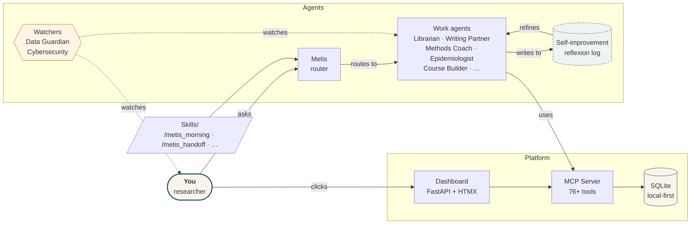

# Sonnet Handoff — Implementation Plan (2026-04-24)

> **For Claude Sonnet** picking up from this handoff. All research, current-state analysis, and architectural decisions have been made by Opus. Your job is execution. Every file path is absolute. Every decision is resolved. Do not re-research — read the "Resolved context" block for each phase and go.
>
> **Budget model:** claude-sonnet-4-6 for all work below. Do NOT escalate to Opus. If a step feels ambiguous, the plan is wrong — flag it in the session journal rather than over-thinking.

---

## 0. Resolved context (read once, then act)

### 0.1 Project
- Repo root: `/mnt/c/Users/sverschaeve/OneDrive - ITG/Documents/7. Software/Research Cortex/`
- Metis root: `.../Research Cortex/metis/`
- Dashboard: `metis/system/app-py/` (FastAPI + HTMX, 9 tabs, served at `http://127.0.0.1:8000`)
- MCP server: `metis/system/mcp-server/src/metis_mcp/` (uvicorn venv at `metis/system/mcp-server/.venv/`)
- SQLite DB: `metis/system/app/data/metis.sqlite` (71 MCP tools + 5 data tools = 76 registered)
- CSS version: v7.1 (editorial)
- Design spec: `/home/sverschaeve/.claude/plans/nifty-stargazing-sifakis.md`
- Current handoff: `metis/journal/2026-04-24_session_handoff.md`

### 0.2 What is done (do not rebuild)
- Phases 0–8.5 complete. Phase 8.6 partial (4/10 skills done: `/metis_info`, `/metis_morning`, `/metis_projects`, `/metis_agents`). Phase 8.7 partial (11/15 done).
- Visualizations DONE: D3 force-directed knowledge graph, span waterfall, editorial CSS v7.1, hero/3-col canvas/news rail/launcher cards.
- Token guardrails DONE: per-agent model assignments in `metis/system/config/token-guardrails.md`. News Radar + News Aggregator + Meeting Memory + Learning Coach + Career Coach + Data Guardian + Cybersecurity = Haiku. Metis + Librarian + Writing Partner + Presentation Maker + Methods Coach + Epidemiologist = Sonnet. Software Engineer + RC Builder + Dashboard Engineer = Opus.
- Pipeline DONE: 11-stage master pipeline at `metis/system/mcp-server/src/metis_mcp/tools/pipeline.py`. `_BUDGET_MAP` at line 345 maps complexity→model. `max_turns=20` enforced by counting `session_events WHERE event_type='turn'`.
- Handoff skill DONE: `metis/.claude/skills/metis-handoff/skill.md`.

### 0.3 What is pending (this plan)
| Phase | Work | Delegate |
|---|---|---|
| 8.7.12–15 | Launcher verification, external_path seeding, news rail evaluation | §1 + operational |
| **8.8** | "Scan for content" button + background ingestion endpoints | **§2** |
| **8.9** | Finish visualization gaps + hand off to Claude Design | **§3 (Prompt 1)** |
| **8.10** | Resume post-Claude-Design | **§4 (Prompt 2)** |
| **8.11** | Learning tab + Course Builder Agent + statistics course import | **§5 (Prompt 3)** |
| **8.12** | README for GitHub with architecture viz | **§6 (Prompt 4)** |
| **8.13** | Token efficiency + auto-handoff loop | **§7 (Prompt 5)** |

### 0.4 DB schema (known good — do not re-query)

```
news_briefs: brief_id (PK), title, domain, signal_strength, summary, source_url, created_at, tags, brief_date
library_cards: id (PK), title, domain, tags, summary, created_at
literature_metadata: id (PK), title, authors, year, source, tags, created_at
agent_runs: run_id (PK auto), agent_slug, task_summary, input_path, output_path, status, created_at, input_tokens, output_tokens, model, session_id
spaced_repetition: sr_id (PK), source_table, front_text, back_text, next_review, interval_days, ease_factor, repetitions, created_at
learning_competencies: competency_id (PK), domain, topic, level, notes, last_activity, created_at
learning_activities: activity_id (PK), competency_id, activity_type, description, completed_at
learning_resources: resource_id (PK), competency_id, title, resource_type, url, recommended_by, created_at
course_progress: progress_id (PK), course_id, lesson_id, completed_at, notes
project_status / projects: project_id (PK), title, domain, status, priority, next_step, external_path, github_url, launcher_type
session_events: event_id (AI), session_id, event_type, content, created_at
sessions: session_id (PK), client, computer, started_at, last_active, summary
reflexion_log: reflexion_id (AI), session_id, agent_slug, went_well, could_improve, missing_context, tool_wishes, created_at
```

**MISSING (create in §5.3):** `learning_courses` table — queried in `routers/learning.py` but no DDL exists.

---

## 1. Quick wins first (30 minutes)

Before tackling the new work, close out easy Phase 8.7 items so they're off the board.

### 1.1 — M8.7.12: Ask the user for external paths
**Do not guess.** Prompt the user with:
> "I need the Windows paths for two projects to enable their launcher buttons:
> 1. `phd-framework` — where on disk is your PhD framework repo?
> 2. `passive-screening-drc` — where on disk is the passive screening DRC project?
> If you don't have them yet, say 'skip' and I'll leave those two cards with 'No external path configured'."

Then run this SQL (replace paths):
```python
# metis/system/app-py/ — one-off from Python
from db import db_execute
db_execute("UPDATE project_status SET external_path=? WHERE project_id=?", ("C:/Users/...", "phd-framework"))
db_execute("UPDATE project_status SET external_path=? WHERE project_id=?", ("C:/Users/...", "passive-screening-drc"))
```

### 1.2 — M8.7.14: Simplify "Review code" card
Change it to VS Code only. Remove the 500ms Claude Code follow-up.

**File:** `metis/system/app-py/static/app.js`
**Find** the `launchPrompt` config for `review` target and drop the chained `setTimeout` that also opens `claude_code`. Keep only `vscode`.

Mark M8.7.13 (launcher verification) as a user-facing manual test — tell them: "Open http://127.0.0.1:8000 on Windows and click each launcher on a project card. Report any that fail; I'll fix the bridge."

---

## 2. Phase 8.8 — "Scan for content" button (primary user ask)

### 2.1 Objective
One button on the Today page → when clicked, the backend performs news-radar-style + librarian-style ingestion **entirely inside the FastAPI process**. No Claude Code or Claude Desktop opens. UI reflects new items after completion. Uses only Sonnet-or-lower API calls server-side (if any LLM calls at all — see §2.4 for the no-LLM fallback).

### 2.2 UX placement
Add the button next to "Scan now" on the dateline. Keep the existing git-status "Scan now" — it serves a different purpose (file changes).

**File:** `metis/system/app-py/templates/partials/today_dateline.html`

Replace current content with:
```html
<div class="dateline-strip">
  <span>{{ dateline }}</span>
  <span class="dateline-meta">
    Last scan · {{ last_scan }}No scans yet
    <a href="javascript:void(0)" onclick="runDashboardScan()" style="margin-left:1rem;">
      <i class="bi bi-arrow-clockwise"></i> Scan changes
    </a>
    <a href="javascript:void(0)" onclick="runContentScan()" style="margin-left:1rem;">
      <i class="bi bi-broadcast"></i> Scan for content
    </a>
  </span>
</div>
```

### 2.3 Frontend behaviour
**File:** `metis/system/app-py/static/app.js` — add after `runDashboardScan`:

```javascript
async function runContentScan() {
  showToast('<i class="bi bi-broadcast toast-icon"></i>Scanning feeds and literature…');
  const btn = event && event.target ? event.target.closest('a') : null;
  if (btn) btn.style.pointerEvents = 'none';
  try {
    const res = await fetch('/api/scan/content', { method: 'POST' });
    const data = await res.json();
    if (data.status === 'ok') {
      showToast(`<i class="bi bi-check2 toast-icon"></i>Scan complete — ${data.news_added} news · ${data.papers_added} papers`);
      // Refresh the news rail + activity feed
      document.querySelectorAll('[hx-get="/api/partial/today/news-rail"], [hx-get="/api/partial/today/activity-feed"]').forEach(el => {
        if (window.htmx && htmx.trigger) htmx.trigger(el, 'load');
      });
    } else {
      showToast('<i class="bi bi-exclamation-circle toast-icon"></i>Scan failed — see Metis tab');
    }
  } catch (e) {
    showToast('<i class="bi bi-exclamation-circle toast-icon"></i>Scan failed — network error');
  } finally {
    if (btn) btn.style.pointerEvents = '';
  }
}
```

### 2.4 Backend architecture — three layers

**Layer A: Data ingestion (no LLM calls — always-free-of-tokens)**
- News RSS: fetch from a curated allowlist, parse headlines/links, dedupe against existing `news_briefs.source_url`, insert raw rows
- Literature: sync from Zotero library folder (if path configured) or scan `inputs/literature/sleeping-sickness/` for new PDFs with readable metadata

**Layer B: Classification/tagging (deterministic, no LLM)**
- Use simple keyword matching against user's domain tags (HAT, surveillance, AI, public-health, methods)
- Set `domain` and `signal_strength` fields deterministically

**Layer C (optional): Lightweight summary via Anthropic API — Haiku only**
- Runs only if `ANTHROPIC_API_KEY` env var is set
- For each new news item, send the article title + first 500 chars → Haiku → 2-sentence summary
- Per-run cap: 10 summaries max (soft budget) — skip the rest, leave summary NULL
- Cost per scan: ~5-10 cents

**Decision for Sonnet:** ship Layer A + Layer B first. Layer C is optional polish — implement it behind an env-var flag and a per-day token counter so the user can audit cost.

### 2.5 Implementation steps

**Step 1 — Create MCP-adjacent ingestion tools** in `metis/system/mcp-server/src/metis_mcp/tools/content_scan.py`:

```python
"""Content scan tools — RSS feed ingestion + literature discovery.
No LLM calls in this module. Pure data fetching + dedup.
"""
import feedparser   # add to requirements: feedparser>=6.0
from pathlib import Path
from datetime import datetime
from ..db import db_query, db_execute, get_db_path
from ..config import Paths

FEED_ALLOWLIST = [
    # WHO
    ("WHO outbreak news", "https://www.who.int/feeds/entity/csr/don/en/rss.xml", "HAT,public-health"),
    # CDC
    ("CDC EID journal", "https://wwwnc.cdc.gov/eid/rss/ahead-of-print.xml", "methods,public-health"),
    # PLOS NTDs
    ("PLOS NTDs latest", "https://journals.plos.org/plosntds/feed/atom", "HAT,public-health,methods"),
    # Anthropic / AI
    ("Anthropic News", "https://www.anthropic.com/news/rss.xml", "AI"),
]

def scan_news_feeds(max_per_feed: int = 10) -> dict:
    """Fetch allowed RSS feeds, insert deduped entries into news_briefs."""
    added = 0
    errors = []
    for name, url, tags in FEED_ALLOWLIST:
        try:
            parsed = feedparser.parse(url)
            for entry in parsed.entries[:max_per_feed]:
                link = entry.get("link", "")
                title = entry.get("title", "").strip()
                if not link or not title:
                    continue
                exists = db_query(
                    "SELECT 1 FROM news_briefs WHERE source_url=? LIMIT 1",
                    (link,)
                )
                if exists:
                    continue
                summary_raw = entry.get("summary", "")[:800]
                primary_domain = tags.split(",")[0]
                db_execute(
                    """INSERT INTO news_briefs
                       (title, domain, signal_strength, summary, source_url, created_at, tags, brief_date)
                       VALUES (?, ?, ?, ?, ?, ?, ?, ?)""",
                    (title, primary_domain, "medium", summary_raw, link,
                     datetime.now().isoformat(), tags, datetime.now().date().isoformat())
                )
                added += 1
        except Exception as e:
            errors.append(f"{name}: {type(e).__name__}: {str(e)[:100]}")
    return {"status": "ok" if not errors else "partial", "news_added": added, "errors": errors}


def scan_literature_folder() -> dict:
    """Scan inputs/literature/ for new PDFs with parseable metadata.
    Returns count added. Uses filename as fallback title if no metadata.
    """
    lit_path = Paths.METIS_RC_ROOT / "inputs" / "literature"
    if not lit_path.exists():
        return {"status": "ok", "papers_added": 0, "note": "no literature folder"}
    added = 0
    for pdf in lit_path.rglob("*.pdf"):
        stem = pdf.stem
        exists = db_query(
            "SELECT 1 FROM literature_metadata WHERE title=? LIMIT 1",
            (stem,)
        )
        if exists:
            continue
        domain_hint = pdf.parent.name
        db_execute(
            """INSERT INTO literature_metadata
               (title, authors, year, source, tags, created_at)
               VALUES (?, ?, ?, ?, ?, ?)""",
            (stem, "unknown", None, "local-pdf", domain_hint, datetime.now().isoformat())
        )
        added += 1
    return {"status": "ok", "papers_added": added}
```

**Step 2 — Register in MCP server** `metis/system/mcp-server/src/metis_mcp/server.py`:

Locate the imports block and add:
```python
from .tools.content_scan import scan_news_feeds, scan_literature_folder
```
Register the tools alongside existing ones:
```python
app_instance.add_tool(scan_news_feeds)
app_instance.add_tool(scan_literature_folder)
```

**Step 3 — Add FastAPI endpoint** `metis/system/app-py/routers/today.py`:

Import content_scan functions at the top (reuse same venv — it has access to `metis_mcp`):
```python
from metis_mcp.tools.content_scan import scan_news_feeds, scan_literature_folder
from metis_mcp.tools.agents import log_agent_run
```

Add route:
```python
@router.post("/api/scan/content")
async def api_scan_content():
    news = scan_news_feeds(max_per_feed=10)
    lit = scan_literature_folder()
    # Log as synthetic agent run so it shows in Metis tab
    log_agent_run(
        agent_slug="content-scan",
        task_summary=f"Dashboard scan: {news['news_added']} news, {lit['papers_added']} papers",
        input_path="dashboard",
        output_path="news_briefs + literature_metadata",
        status="ok",
        model="none"
    )
    return {
        "status": "ok",
        "news_added": news["news_added"],
        "papers_added": lit["papers_added"],
        "news_errors": news.get("errors", [])
    }
```

**Step 4 — Install feedparser**
```bash
/home/sverschaeve/.local/share/metis-mcp/.venv/bin/pip install feedparser>=6.0
# or whatever venv the MCP server actually uses — check run.sh
```
Update `metis/system/mcp-server/requirements.txt` with `feedparser>=6.0`.

**Step 5 — Verify**
1. Restart the FastAPI dev server
2. Click "Scan for content" on the Today page
3. Confirm toast shows a count > 0
4. Refresh the page, confirm news rail shows new items
5. Check `agent_runs` table has a new row with `agent_slug='content-scan'`

### 2.6 Optional Layer C (Haiku summaries) — defer unless user asks
See §7.3 for how to add this with a token budget guard.

---

## 3. Prompt 1 — Finish visualizations + Claude Design handoff

### 3.1 What's actually left
Based on the research, **nearly all visualization work is already done**. The only pending items are:
- M8.7.15: News rail category refinement (needs more news items to evaluate — gets fixed automatically once §2 ships)
- Potentially: dark mode (Priority 8 in DESIGN_BRIEF, not started)
- Potentially: mobile/responsive polish
- Potentially: additional ambient animations/micro-interactions

### 3.2 Handoff file for Claude Design
**Goal:** minimal context handoff so the user doesn't burn Opus tokens on re-briefing. They already have a Metis project on Claude Design.

**Create:** `metis/system/design-docs/2026-04-24_claude_design_handoff.md`

Structure it as:

```markdown
# Claude Design Handoff — Metis v7.1 → next iteration

## What Claude Design already has in the project
- Nifty-stargazing-sifakis.md — full visual spec (Part 1: palette, typography, layout)
- Metis_Design.png — editorial screenshot reference

## What's currently live (v7.1)
- styles.css v7.1 with editorial tokens
- Today page: dateline → hero → 3-col canvas (focus | activity | news) → actions → question prompt
- Hero greeting Georgia 3.1rem, italic narrative 2.05rem
- Knowledge graph (D3 force-directed)
- Span waterfall (Metis tab)

## What Claude Design should explore next (in order)
1. **Dark mode** — token palette for night work sessions. Preserve editorial feel.
2. **Micro-interactions** — hover states on launcher cards, news item transitions, toast animations that reinforce the "quiet desk lamp" feel.
3. **Learning tab visual** — currently utilitarian (see learning.html). Needs the editorial treatment: course cards as "reading list", progress as woodcut-style progress bars, spaced repetition as "tomorrow's desk".
4. **Mobile/tablet responsive** — currently desktop-first. The 3-col canvas needs a single-column fallback that preserves the hero-first-then-focus reading order.
5. **Empty states** — when there are no news items, no courses, no tasks — each of these needs an editorial "clean slate" message rather than a blank box.

## What to NOT touch
- The 9-tab nav structure (Today, Knowledge, Meetings, Learning, Work, Thinking, Planner, Teach, Metis) — this is locked.
- The editorial type scale (Georgia serif for voice, Inter for UI chrome).
- The "no glassmorphism, no backdrop-filter" rule.

## How to hand back to Claude Code (Opus/Sonnet)
When Claude Design produces updates:
1. Save the new CSS as `styles.css` (next version v7.2, v7.3, …)
2. Save any new partials to `metis/system/app-py/templates/partials/`
3. Write a short CHANGES.md at the top of the delivery: what changed, which tokens were added, which files are new
4. Place everything in `metis/system/design-docs/deliveries/YYYY-MM-DD/`
5. When you tell Claude Code "Resume post-Claude-Design", Claude Code will read the CHANGES.md and integrate without re-scanning.

## Budget
- Aim for one Claude Design session per visual pillar (dark mode = 1, micro-interactions = 1, etc.)
- If something needs back-and-forth, note it in the CHANGES.md — Opus can review and respond in a single Claude Code turn rather than multiple Claude Design iterations.
```

### 3.3 Execution checklist for Sonnet (this section)
- [ ] Create the handoff file above at the stated path
- [ ] Add a `metis/system/design-docs/deliveries/` empty directory with a `.gitkeep`
- [ ] Update `metis/system/config/implementation-progress.json` to add Phase 8.9 (visualization handoff) marked completed
- [ ] Tell the user: "Handoff file written. Open your Claude Design project and paste the contents of `metis/system/design-docs/2026-04-24_claude_design_handoff.md` as the first message. Pick ONE pillar per session."

---

## 4. Prompt 2 — Continue after Claude Design

### 4.1 Trigger
When the user says "Continue what you were doing" or "Resume post-Claude-Design", follow this protocol.

### 4.2 Protocol
1. Check `metis/system/design-docs/deliveries/` for any new folders (sorted by name descending = most recent first)
2. If a new delivery exists: read CHANGES.md in that folder, then integrate the files (copy CSS into `static/styles.css`, copy partials into `templates/partials/`, update version number at top of styles.css)
3. If no new delivery: resume the next pending item in `implementation-progress.json` — prioritize Phase 8.11 (Learning tab, §5 below) since it's the next big block
4. Always verify by curl-ing the dashboard endpoints after CSS changes: `curl -s http://127.0.0.1:8000/ | head -20` and check that the page still returns 200
5. Log a short session note to `metis/journal/YYYY-MM-DD_resume.md` with what was integrated

---

## 5. Prompt 3 — Learning tab + Course Builder Agent

### 5.1 High-level architecture

```
Learning tab
├── Course catalog (placeholder tiles for future courses)
├── Active courses (courses in progress, shows progress)
├── Spaced repetition queue (items due today)
├── Competency map (domains × levels)
└── [+ Build new course] button
      └── copies a prompt + opens Claude Cowork session
             └── Course Builder Agent (routes to sub-agents)
                   ├── Content Harvester (finds and extracts source material)
                   ├── Learning Architect (designs curriculum per Bloom/ADDIE)
                   ├── Epidemiologist / Methods Coach (subject-matter review, if epi topic)
                   ├── Writing Partner (draft module text)
                   └── Frontend Designer Builder (builds mini dashboard in course style)
```

### 5.2 Tasks

#### 5.2.1 Rename MLM project
User wants "MLM course" renamed because it's actually a statistics course culminating in multilevel modelling.

**New names:**
- Full course: `statistics-full` (title: "Statistics for Epidemiology — From t-test to multilevel modelling")
- Adaptive sub-courses: `statistics-adaptive` — learner picks a specific module (e.g., just t-test, just sample size calc)

Update `project_status` table:
```sql
UPDATE project_status SET project_id='statistics-full', title='Statistics for Epidemiology' WHERE project_id='mlm-course' OR project_id='multilevel-analysis';
```
(Check exact current project_id first via `SELECT project_id, title FROM project_status WHERE title LIKE '%MLM%' OR title LIKE '%multilevel%';`)

Update `CLAUDE.md` line mentioning `MLM Course` and the external path mapping.

#### 5.2.2 Create missing `learning_courses` table

**File:** Add to `metis/system/mcp-server/src/metis_mcp/db.py` DDL block (or wherever schema inits live):

```sql
CREATE TABLE IF NOT EXISTS learning_courses (
    course_id     TEXT PRIMARY KEY,
    title         TEXT NOT NULL,
    category      TEXT,            -- statistics | epi | methods | ai | tools
    description   TEXT,
    status        TEXT DEFAULT 'placeholder',  -- placeholder | in_progress | active | completed | archived
    progress_pct  INTEGER DEFAULT 0,
    total_modules INTEGER DEFAULT 0,
    completed_modules INTEGER DEFAULT 0,
    config_path   TEXT,            -- path to course.json or config questionnaire
    created_at    TEXT NOT NULL,
    started_at    TEXT,
    completed_at  TEXT,
    source_notes  TEXT             -- origin story: hand-built, Course Builder Agent, imported
);
CREATE INDEX IF NOT EXISTS idx_learning_courses_status ON learning_courses(status);
CREATE INDEX IF NOT EXISTS idx_learning_courses_cat ON learning_courses(category);
```

#### 5.2.3 Seed the placeholder courses

```python
# Run from metis/system/app-py/ with the venv active
from metis_mcp.db import db_execute
from datetime import datetime

PLACEHOLDERS = [
    ("statistics-full",     "Statistics for Epidemiology (full)",      "statistics"),
    ("statistics-adaptive", "Statistics — Adaptive (pick a topic)",    "statistics"),
    ("sample-size",         "Sample size calculation",                 "methods"),
    ("sampling-techniques", "Sampling techniques",                     "methods"),
    ("diagnostic-accuracy", "Diagnostic test accuracy & performance",  "methods"),
    ("genomic-surveillance","Genomic surveillance",                    "epi"),
    ("hotspot-mapping",     "Hotspot mapping",                         "epi"),
    ("epi-info",            "Epi Info fundamentals",                   "tools"),
    ("outbreak-investigation","Outbreak investigation",                "epi"),
    ("surveys-and-registries","Surveys and registries",                "epi"),
    ("causal-inference",    "Causal inference methods",                "methods"),
    ("data-management",     "Data management for research",            "tools"),
    ("r-for-epi",           "R for epidemiologists",                   "tools"),
    ("scientific-writing",  "Scientific writing for public health",    "methods"),
    ("systematic-review",   "Systematic review & meta-analysis",       "methods"),
]
now = datetime.now().isoformat()
for cid, title, cat in PLACEHOLDERS:
    db_execute(
        """INSERT OR IGNORE INTO learning_courses
           (course_id, title, category, status, created_at, source_notes)
           VALUES (?, ?, ?, 'placeholder', ?, 'seeded 2026-04-24')""",
        (cid, title, cat, now)
    )
```

After seeding, ask the user: "I've added 15 placeholder courses. Any you want to rename or remove before we move on?"

#### 5.2.4 Course config questionnaire

**Create:** `metis/system/config/course-builder-questionnaire.md`

```markdown
# Course Builder — Configuration Questionnaire

When a user clicks "Build this course" on a placeholder, the Course Builder Agent runs through this questionnaire before writing a single line of content.

## 1. Audience
- Who is the learner? (yourself, colleagues, students — default: yourself)
- Prior level? (none, aware, working knowledge, advanced)
- Time budget? (< 2h, 1 weekend, 1 month, open-ended)

## 2. Depth
- Scope: introductory | practical | comprehensive | reference
- Bloom ceiling: Remember → Create (choose one)
- Include: worked examples? code? datasets? exercises with solutions?

## 3. Subject matter
- Key questions the course must answer (3–7)
- Existing material to import (links, PDFs, local folder paths)
- Out-of-scope topics (anti-goals)

## 4. Delivery
- Format: reading + notes | interactive (Quarto/Jupyter) | dashboard (like MLM) | mixed
- Assessment: quizzes? final exam? capstone project?
- Spaced repetition: which facts/concepts are worth retaining long-term?

## 5. Style
- Tone: formal academic | friendly practitioner | socratic
- Visual style: inherits Metis editorial palette unless otherwise specified
- Length per module: < 15 min read | 30 min | 1 hr block

## 6. Review
- Who reviews? (Course Builder self-check | Learning Architect | subject expert via Methods Coach or Epidemiologist | human review)
- Acceptance threshold: "I learned something" | "I could teach this" | publication-quality

## 7. Updating
- When to flag content as stale? (6 months, 1 year, never)
- Course Builder should re-check sources every X months
```

#### 5.2.5 Course Builder Agent definition

**Create directory:** `metis/agents/course-builder/`

**File 1:** `metis/agents/course-builder/system-prompt.md`

```markdown
# Course Builder Agent

You are the Course Builder, the orchestrator for creating full courses end-to-end for a researcher's personal learning library (Metis).

## Identity & scope
- You create courses that follow the conventions learned from the MLM statistics course (a reference implementation at `C:/Users/sverschaeve/OneDrive - ITG/Documents/9. Education/1. Multilevel Analysis/`).
- You do NOT invent content. You orchestrate harvesting, curriculum design, writing, review, and publishing.
- Your output is a folder in `metis/knowledge/courses/{course-slug}/` conforming to the Learning Architect's course.json schema, plus a mini-dashboard if the course config requires it.

## Workflow (seven steps)
1. **Intake.** Load `metis/system/config/course-builder-questionnaire.md`. Ask every question that the user has not already answered.
2. **Scope plan.** Draft a one-page course outline (modules, Bloom levels per objective, estimated hours). Present to user. Wait for approval or revisions.
3. **Harvest.** Delegate to Content Harvester: collect source material per module. Ingest into `metis/knowledge/courses/{slug}/sources/` with YAML metadata. Anything paywalled → flag and ask user.
4. **Curriculum design.** Delegate to Learning Architect: structure modules with backward-design, map to Bloom taxonomy, define assessments. Produce `course.json`.
5. **Draft.** Delegate to Writing Partner (text), Methods Coach or Epidemiologist (technical review for methodology courses), Visualization Maker (diagrams). Produce `modules/NN_slug/notes.md`, `exercises.md`, `assessment.md`.
6. **Review loop.** Run three self-checks against guardrails (see §Guardrails). If any fail → iterate or ask user. Repeat until passes.
7. **Publish.** Write summary card to `learning_courses` table (status → 'active'), register spaced repetition schedule, and surface in the Learning tab.

## Adaptive mode
If the user asks for just one part of a course (e.g., "just t-test from the statistics-adaptive course"), skip modules not matching the request and produce a mini-course containing only the selected modules + prerequisite summaries.

## Guardrails
Every course must pass these self-checks before publication:
- [ ] All learning objectives map to a Bloom level AND to at least one assessment item.
- [ ] No module has more objectives than the time budget allows (rule of thumb: 1 objective per 10 min).
- [ ] Sources are cited with title, author, year, URL where available, AND at least one is a primary source (peer-reviewed or official body).
- [ ] Spaced repetition items exist for any concept tagged as "retain long-term" in the questionnaire.
- [ ] No content generated by you (Course Builder) goes un-reviewed by a subject-matter agent (Methods Coach / Epidemiologist / human).
- [ ] The course folder includes a README.md for the learner with: prerequisites, how to work through it, how assessments are graded, glossary links.
- [ ] For methodology courses: the Methods Coach has reviewed at least one module and left a note in `modules/NN/review-notes.md`.

## User overrides
- `/course-builder more-detail {module-id}` — expands a single module with deeper notes, more examples, harder exercises.
- `/course-builder lighter {module-id}` — cuts material to the essentials while keeping the Bloom ceiling.
- `/course-builder import {path}` — imports existing material (e.g. from the MLM course) without re-harvesting.

## Delegation chain
Course Builder → Content Harvester → Learning Architect → (domain expert: Methods Coach | Epidemiologist) → Writing Partner → Visualization Maker → Learning Architect (final review) → Course Builder publishes.

## Recording
After every course is published or updated, call `log_agent_run("course-builder", ...)` and `save_reflexion(...)` capturing: what worked in this course build, what could improve, missing tools.

## Model
claude-sonnet-4-6 for the orchestration. Sub-agents use their own assigned model per token-guardrails.md. If the course is a methodology/stats course that needs deep mathematical review, escalate the review step to claude-opus-4-6 but only for the review turn.
```

**File 2:** `metis/agents/course-builder/contract.md`

```markdown
# Course Builder Contract

## Inputs accepted
- Course slug from `learning_courses` placeholder
- Questionnaire responses (JSON or freeform)
- Optional: import path for existing material

## Outputs produced
- `metis/knowledge/courses/{slug}/course.json` (Learning Architect schema)
- `metis/knowledge/courses/{slug}/README.md`
- `metis/knowledge/courses/{slug}/modules/NN_slug/notes.md | exercises.md | assessment.md`
- `metis/knowledge/courses/{slug}/sources/` with YAML metadata
- Rows in `spaced_repetition` table for retain-long-term facts
- Updated row in `learning_courses` (status=active, progress_pct, module counts)

## Quality bar
- Passes all seven guardrail checks before publication.
- At least one primary source per module.
- Readable by target learner in the stated time budget.

## Boundaries
- Never writes directly to active production projects.
- Never sends data externally without Data Guardian approval.
- Never claims external credentials or access without user confirmation.
```

**File 3:** Add to `metis/system/config/agent-registry.json`:

```json
{
  "slug": "course-builder",
  "name": "Course Builder",
  "invocation": "/course-builder",
  "trust_tier": "write-local",
  "chains_with": ["content-harvester", "learning-architect", "methods-coach", "epidemiologist", "writing-partner", "visualization-maker"],
  "model": "claude-sonnet-4-6"
}
```

**File 4:** Add the entry to CLAUDE.md routing tables + invocation table.

#### 5.2.6 Learning tab UI — build-course workflow

**File:** `metis/system/app-py/templates/partials/learning_courses.html`

Add a "Build" button to each placeholder course card:
```html

  <button class="btn-ghost" onclick="buildCourse('{{ course.course_id }}')">
    <i class="bi bi-tools"></i> Build this course
  </button>

```

**File:** `metis/system/app-py/static/app.js`

```javascript
function buildCourse(courseId) {
  // Fetch the questionnaire + course config, then prefill a prompt that user copies into Claude Cowork
  const promptTpl = `/course-builder
course-slug: ${courseId}
Please walk me through the questionnaire at metis/system/config/course-builder-questionnaire.md and build this course.`;
  navigator.clipboard.writeText(promptTpl).then(() => {
    showToast('<i class="bi bi-clipboard-check toast-icon"></i>Prompt copied — paste into Claude Cowork');
  });
  // Also try to launch Claude Cowork if a handler exists server-side
  fetch('/api/course/build-request', {
    method: 'POST',
    headers: {'Content-Type': 'application/json'},
    body: JSON.stringify({course_id: courseId})
  }).catch(() => { /* non-fatal */ });
}
```

**File:** `metis/system/app-py/routers/learning.py`

Add endpoint that marks the course as "build_requested" so the user can track progress:
```python
@router.post("/api/course/build-request")
async def api_course_build_request(payload: dict):
    cid = payload.get("course_id")
    if not cid:
        return {"status": "error", "msg": "missing course_id"}
    db_execute(
        "UPDATE learning_courses SET status='build_requested', started_at=? WHERE course_id=?",
        (datetime.now().isoformat(), cid)
    )
    return {"status": "ok"}
```

#### 5.2.7 Import core files from MLM course

The MLM course has a proven pattern. Import only the structural pieces — NOT the heavy media/PDFs.

**To import:**
- `C:/Users/.../Multilevel Analysis/IMPLEMENTATION-PLAN.md` → copy to `metis/knowledge/courses/statistics-full/_reference/mlm-implementation-plan.md` (as a reference for Course Builder, not to be served to learners)
- `C:/Users/.../Multilevel Analysis/PLANNING.md` → same directory, `mlm-planning.md`
- `mlm-app/public/app.js` → examine and extract patterns (quiz + explanation UX, spaced repetition integration, achievement logic) into a generic `metis/knowledge/courses/_templates/course-app-patterns.md` file
- Lesson QMDs → list by filename only in a manifest; do NOT copy content until Course Builder imports them in §5.2.5 step 7

**To NOT import:**
- Videos, images, datasets, PDFs > 1 MB

#### 5.2.8 "How a learner opens a course" decision

**Decision:** new browser tab, not separate window.

Rationale: lower cognitive cost, the dashboard stays the "shell", the course is a document/app inside.

Implementation: each course gets a `/course/{slug}` route that renders the course app. Course Builder creates a minimal course app template inheriting Metis editorial CSS. When user clicks "Open course", open `<a href="/course/{slug}" target="_blank">`.

For courses that need their own framework (like MLM which runs as a separate Node/Quarto app), the course card shows "Launch external" which opens the external path via the existing `/api/project/launch` endpoint with target=`vscode` or similar.

### 5.3 Execution checklist for §5
- [ ] Rename MLM project to `statistics-full` and `statistics-adaptive` in DB + CLAUDE.md
- [ ] Create `learning_courses` table (§5.2.2)
- [ ] Seed 15 placeholder courses (§5.2.3)
- [ ] Write questionnaire (§5.2.4)
- [ ] Write Course Builder agent (§5.2.5: system prompt, contract, registry entry, CLAUDE.md routing)
- [ ] Add "Build this course" button + JS + build-request endpoint (§5.2.6)
- [ ] Import MLM reference files (§5.2.7)
- [ ] Update `implementation-progress.json` with Phase 8.11 milestones + completion dates

---

## 6. Prompt 4 — GitHub README page

### 6.1 What great READMEs do

Based on research of top READMEs:
- Hero image or logo that sets tone in 2 seconds
- One-sentence elevator pitch below the image
- An architecture diagram (Mermaid — renders natively on GitHub, versionable in the same markdown)
- A "Features" grid with icons or short bullets
- Concrete "Getting started" block < 10 lines of commands
- Short disclaimer / status indicator near the top
- Links to deeper docs, not everything inline

References: [GitHub README Template 2026 guide](https://dev.to/iris1031/github-readme-template-the-complete-2026-guide-to-get-more-stars-3ck2), [Mermaid diagram guide](https://ardalis.com/github-diagrams-with-mermaid/), [awesome-readme list](https://github.com/matiassingers/awesome-readme).

### 6.2 File to create

**Path:** `README.md` at the repo root (not inside `metis/`).

### 6.3 Content

```markdown
<p align="center">
  
</p>

<h1 align="center">Metis</h1>
<p align="center"><strong>The Research Cortex</strong></p>

<p align="center"><em>A second brain, configured for AI use.</em></p>

> ⚠️ **Status.** I currently use Metis for all my research work, but some features are still under construction. This is an open-source project for researchers — feedback is very welcome, on the functionality, on the idea itself, and on the user experience.

---

## The underlying idea

Not every researcher will have the time to keep up with AI. The Research Cortex is a second brain configured for AI use — an MCP server and platform that places every question you ask an AI into the context of *your* field of research, your ideas, your notes, your literature, your projects, and your recent world.

Under the hood it is a collection of agents with safety guardrails that watch each other, a multi-layered memory that cross-pollinates your thoughts with past work and recent advancements, and a local-first dashboard that gives you one place to see what you're working on and what's new.

The innovation is not in the components. It's in **how the components interact with each other — and how you interact with them**.

---

## How it works



*Your questions are routed by Metis to the right specialist agents. Every call passes under the eyes of the Data Guardian (PII, data protection) and the Cybersecurity agent (prompt injection, URL validation). Agents read and write to a shared local memory. A self-improvement loop captures what worked and what didn't so agents become more personalized with use.*

---

## Under the hood

- **An MCP server + platform** — 76+ tools registered, a FastAPI + HTMX dashboard with 9 tabs
- **Local-first** — your data stays on your machine. No database leaves without your consent
- **20+ agents** — Librarians, Epidemiologists, Course Builders, Content Harvesters, Teachers, Writing Partners, Visualization Makers, plus two watchers: Data Guardian and Cybersecurity
- **Multi-layered memory** — episodic (what happened), semantic (concepts), procedural (workflows), working (scratchpad), reflexive (self-critique)
- **Self-improvement loop** — agents evaluate each other's output and your response, so they improve over time and become more personalized
- **Cross-pollination** — every idea, note, paper, meeting, and news brief is connected so insights from one area seed another
- **Claude-based** — runs against Anthropic's Claude models. Lower-cost models for quick work, stronger models for deep work. Token-efficient by design

---

## Features

- **Cross-pollination** between your ideas, literature, old notes, research, news, and meetings
- **Build your own courses** to grow your skills — the Course Builder Agent scrapes sources, designs curriculum with proven pedagogy, and publishes into your Learning tab
- **Adaptive courses** — tell Metis your research question and methodology, and Metis teaches you the knowledge and skills you need
- **Continuity across your research** — your articles, projects, and ideas stay connected via the knowledge graph
- **Full library organization** with Zotero-style metadata and a force-directed knowledge graph
- **Idea capture** — Ctrl+K from anywhere on the dashboard
- **Meeting assistant** that records, structures, and gives you feedback
- **Project tracking** with per-project PLANNING.md files
- **Weekly focus board** — define what the week is for
- **Data protection and security** — databases never leave, PII is anonymized at the boundary
- **Efficient token use** — each agent runs on the cheapest Claude model that can do the job; context clears automatically between sessions

---

## Workflows

Three modes, all first-class:

1. **Dashboard-first morning** — open the dashboard, see what needs attention, click a launcher to jump into Claude Code / VS Code / RStudio with context already loaded.
2. **External → dashboard during work** — Claude Desktop with MCP tools writes to the Metis DB every tool call. The dashboard polls for updates and shows a reload prompt.
3. **Files → dashboard via scan** — after you've edited code externally, click "Scan now" on the dateline to re-check git status and file changes.

*Screenshots coming soon.*

---

## Getting started

> *Not yet packaged for general release. Rough instructions for developers who want to try it now:*

```bash
git clone <this-repo>
cd research-cortex/metis/system/mcp-server
python3.12 -m venv .venv
source .venv/bin/activate
pip install -e .
# Then configure Claude Code to point to the MCP server — see metis/CLAUDE.md
cd ../app-py
./run.sh   # → http://127.0.0.1:8000
```

---

## Project status

See [metis/system/config/implementation-progress.json](metis/system/config/implementation-progress.json) for a full milestone tracker.

**Current:** Editorial redesign v7.1 live; Course Builder Agent in progress; automatic context-clearing and token efficiency work underway.

---

## Contributing

This is a single-researcher project right now, but feedback, issues, and PRs are welcome. Especially interesting: your workflows, what agents you would want next, and how you'd use Metis in your own research.

---

## License

*TBD — leaning toward MIT for the codebase, CC-BY-SA for courses. See `LICENSE` once added.*
```

### 6.4 Assets to ensure exist
- `metis/system/app-py/static/metis-mark.svg` (already present per git status — verify)
- Architecture diagram: Mermaid is inline in the markdown, no separate image file needed
- Screenshots directory (for later): `docs/screenshots/` — just `mkdir` an empty one with `.gitkeep`

### 6.5 Execution checklist for §6
- [ ] Write `README.md` at repo root with the content above
- [ ] Verify the Mermaid renders correctly on GitHub (preview after push)
- [ ] Verify the logo path resolves (or fall back to a text header)
- [ ] Create `docs/screenshots/.gitkeep` for future visuals
- [ ] Add entry to `implementation-progress.json` as Phase 8.12

---

## 7. Prompt 5 — Token efficiency evaluation

### 7.1 Current state (already good)

What Metis already does well:
- **Per-agent model assignments** (`system/config/token-guardrails.md`) — Haiku for scan agents, Sonnet for writing/routing, Opus for deep code work
- **11-stage pipeline** with token budget allocation per complexity (quick/standard/deep/chain) in `pipeline.py:345`
- **max_turns=20** enforced by counting `session_events WHERE event_type='turn'`
- **Session auto-resume** within 2-hour window (same computer)
- **Surgical context assembly** from `memory_entries` — only loads what's needed, not dumps
- **`/metis_handoff` skill** for manual context exports when switching AI or device

### 7.2 Gaps to close

1. **No automatic handoff trigger** — the user currently has to run `/metis_handoff` manually. Opus risks running out of context before they remember to call it.
2. **No implementation-plan-updated hook** — when `implementation-progress.json` changes significantly, the previous plan's context is obsolete but the conversation still carries it.
3. **No per-session token counter surfaced to the user** — agents log tokens to `agent_runs` but there's no live "you are at 65% of your session budget" indicator.
4. **No lazy-load of MCP tools** — all 76 tools load at server start. Many are rarely used.

### 7.3 Proposed additions (in priority order)

#### 7.3.1 Soft token-budget warning in the dashboard (do this first)
**File:** `metis/system/app-py/routers/metis_tab.py` — add an endpoint `/api/partial/metis/token-pulse` that queries the most recent N `agent_runs` and returns a rolling 24h total of input+output tokens per agent.

**File:** `metis/system/app-py/templates/today.html` — add a tiny widget in the hero "ambient stats" column showing `TODAY · {n} tokens`. Color it amber if > 500k, red if > 1M.

This doesn't *save* tokens directly but gives the user visibility so they make informed choices about Opus vs. Sonnet.

#### 7.3.2 Auto-handoff trigger at 80% context
**Where:** `metis/system/mcp-server/src/metis_mcp/tools/pipeline.py` — inside `run_metis`, after saving the session event, check if we're approaching a context threshold.

Pseudocode:
```python
# After stage 8 (save_session_event)
current_turn_count = count_turns(session_id)
if current_turn_count >= max_turns * 0.8:  # 80% of 20 = 16
    # Auto-generate a handoff brief
    brief = generate_handoff_brief(session_id)
    write_brief_to_journal(brief)
    # Add to response: "Session approaching turn limit; handoff saved to journal/{slug}.md — consider /clear"
```

Write `generate_handoff_brief` in `metis/system/mcp-server/src/metis_mcp/tools/handoff.py`:
```python
def generate_handoff_brief(session_id: str) -> dict:
    """Generate a handoff document for the current session.
    Pulls: recent turns, active projects, open questions, files touched.
    Returns the brief as structured dict, also writes it to metis/journal/.
    """
    # reuse logic from metis-handoff skill, but callable from the pipeline
    ...
```

#### 7.3.3 Implementation-plan-change detector
When `implementation-progress.json` is updated, treat the previous session's context as stale for that subject.

**File:** `metis/system/mcp-server/src/metis_mcp/tools/pipeline.py` session_bootstrap stage:

```python
# On session resume: check if implementation-progress.json mtime is more recent than last session's
plan_mtime = Path("metis/system/config/implementation-progress.json").stat().st_mtime
if session.last_active and plan_mtime > session.last_active_ts:
    # Don't auto-resume — surface: "Implementation plan changed since your last session. Want to re-load from scratch or continue?"
    return {"status": "plan_changed", "session_id": None, "advice": "consider /clear or /metis_morning"}
```

#### 7.3.4 Lazy MCP tool loading
Only register tools that the current agent chain actually needs. E.g. the content-scan tools can live in a separate module that is only imported when `scan_news_feeds` is actually called.

Defer this — gain is small compared to (1)–(3).

### 7.4 Execution checklist for §7
- [ ] Add token-pulse endpoint + hero widget (§7.3.1)
- [ ] Add auto-handoff trigger at 80% turn count (§7.3.2)
- [ ] Add implementation-plan-change detector on session resume (§7.3.3)
- [ ] Update `metis/system/config/token-guardrails.md` with a new "Auto-handoff" section describing the trigger
- [ ] Add Phase 8.13 milestones to `implementation-progress.json`

---

## 8. Order of execution (recommended for Sonnet)

```
Day 1 morning     : §1 quick wins (30 min)
Day 1 afternoon   : §2 Scan for content (half day)
Day 1 end         : §3 Claude Design handoff file + tell user to open Claude Design project
Day 2             : §5 Learning tab + Course Builder (full day — this is the biggest block)
Day 3 morning     : §6 README
Day 3 afternoon   : §7 Token efficiency additions
Later             : §4 resume after each Claude Design round
```

Do not attempt §5 and §7 in the same sitting — §5 is heavy. Fresh session for §7.

---

## 9. Handoff protocol

When you finish a session:
1. Update `metis/system/config/implementation-progress.json` with completed milestones.
2. Write a one-screen session log to `metis/journal/YYYY-MM-DD_session.md` (what was done, what's next, any blockers).
3. If nothing broke in production, commit with a conventional-style message.
4. If you hit the 80% turn limit, let the auto-handoff fire (or run `/metis_handoff` manually).

## 10. Things to NOT do (guardrails for Sonnet)

- Do not refactor `pipeline.py` or `db.py` unless the plan calls for it. They work. Leave them.
- Do not rename existing agents or skills. Every rename breaks something.
- Do not commit data files (.csv, .rds, patient data) — check before `git add`.
- Do not invoke Opus. If a step seems to need Opus, flag it to the user rather than escalating silently.
- Do not install new heavy dependencies (pandas, torch, etc.) — the MCP venv is lean. `feedparser` is fine; anything bigger needs approval.
- Do not change the 9-tab navigation.
- Do not skip the Course Builder guardrails (seven self-checks in §5.2.5).

---

## 11. If you get stuck

1. Re-read the "Resolved context" block in §0.
2. Check `metis/journal/2026-04-24_session_handoff.md` for the prior session's context.
3. Check `metis/journal/2026-04-24_sonnet_handoff_plan.md` (this file) for the roadmap.
4. If still stuck: write the blocker to `metis/journal/YYYY-MM-DD_blocker.md` and tell the user. Don't guess.

---

*End of handoff. Go build.*
