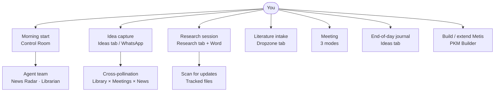
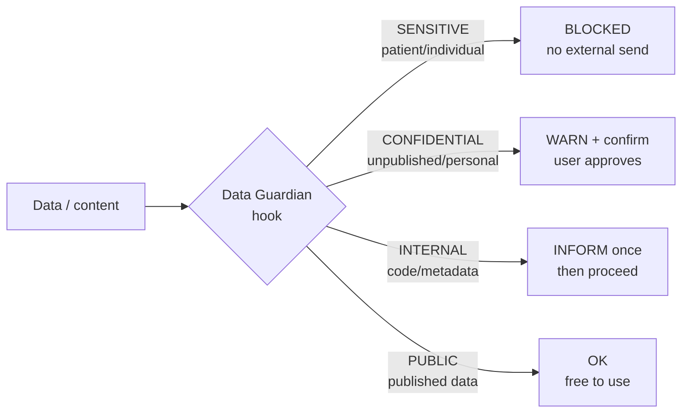

# Metis

**Your research. Your agents. Your rules.**

<p align="center"></p>

---

*A researcher drowning in tabs,*
*with ideas on napkins and scabs,*
&nbsp;&nbsp;*met Metis one day —*
&nbsp;&nbsp;*who said "step away,*
*I'll handle the papers and labs."*

*"Your inbox?" said Metis. "I've read it.*
*That paper you needed? I've seeded it.*
&nbsp;&nbsp;*The meeting last week*
&nbsp;&nbsp;*had the answer you seek —*
*I found it, I tagged it, I threaded it."*

*"But what of my ideas?" you said,*
*"the ones that arrive while in bed?"*
&nbsp;&nbsp;*"Just send me a text.*
&nbsp;&nbsp;*I'll connect it to next*
*Tuesday's paper — consider it read."*

---

*In the beginning, there was a folder called "misc."*
*Then another. Then seventeen browser tabs.*
*Then a PhD, three active projects,*
*a WhatsApp note at 2am*
*that contained either a breakthrough or a grocery list,*
*and forty papers you meant to read.*

*This is Metis.*

---

*Metis remembers.*
*Metis connects.*
*Metis does not sleep.*

*(You still get the coffee.)*

---

## What Metis will never do

No matter what you ask, Metis will not:

1. Send patient or individual-level medical data externally — ever. This is blocked at the system level, with no override.
2. Delete or overwrite your data without asking first.
3. Send your unpublished work, personal information, or confidential files outside your machine without your explicit confirmation.
4. Run an agent action without logging it.
5. Act on an ambiguous or sensitive task without surfacing it to you first.

These are not settings. They are hard constraints built into the system.

### Data classification

| Level | What it covers | What happens |
|-------|---------------|--------------|
| SENSITIVE | Patient/individual records, medical data, GPS coordinates of cases | BLOCKED — no external send, ever |
| CONFIDENTIAL | Unpublished work, personal files, original drafts | WARN + confirm — you must approve before anything leaves your machine |
| INTERNAL | Code, metadata, aggregated outputs | INFORM once, then proceed |
| PUBLIC | Published papers, public datasets, public URLs | OK — free to use |

See `08_system/red-lines.md` for the full policy.

---

## What is this?

Metis is a personal AI system — a team of specialist agents that works with your second brain.

It is not a chatbot you query occasionally. It is a system that runs in the background of your work: cataloguing your literature, watching your inbox, briefing you every morning, and drawing connections between things you read, things you heard in meetings, and ideas you captured at 2am.

At the centre is a **cross-pollination engine**: everything Metis knows about you — your papers, your meetings, your news, your ideas — is searchable and linkable. When you capture a new idea, Metis checks it against your library, your recent meeting notes, and your open projects. Connections surface automatically. You decide what to do with them.

Metis runs as an **MCP server**, which means it can be called from Claude Desktop, Claude Code, or any MCP-compatible client. You can query your entire second brain from a single prompt, anywhere.

---

## Metis becomes yours over time

Metis doesn't start as a generic tool. It starts as a framework and becomes your second brain.

Two mechanisms make this happen:

**1. /metis_config wizard**

Run `/metis_config` to shape the system to your context:
- Your projects, domain, and research area
- Your workflows and how you actually work
- Your data protection preferences
- Your agent team (which agents to activate, which to skip)
- Your news topics, RSS feeds, and literature sources

`/metis_config` can be run at any time — to onboard, reconfigure, or add new context. It is designed to be accessible to people who have never used a CLI or an AI tool before.

**2. Thinking profile**

Metis passively learns your thinking style from how you work:
- Which brainstorm connections you follow up on
- Which ideas you promote to a project
- Which agent outputs you accept vs. flag for improvement
- Which journal reflections you return to

Over time, Metis uses this to re-rank connections (showing what you are most likely to find useful first) and to tune agent defaults. The thinking profile is stored as a human-readable file (`08_system/thinking-profile.yaml`) that you can inspect, edit, or reset at any time. It is surfaced in the System tab under "How Metis knows you."

---

## Workflows

Metis is workflow-defined: the features exist to serve specific ways of working.



| # | Workflow | Entry point | Core agents |
|---|----------|------------|-------------|
| 1 | **Morning start** | Control Room | News Radar, Librarian |
| 2 | **Idea capture (mobile)** | WhatsApp → Twilio → MCP | capture_idea |
| 3 | **Idea capture (desktop)** | Ideas tab → + New idea | capture_idea, cross_pollinate |
| 4 | **Brainstorm session** | Ideas tab → context selector | Metis, domain agents |
| 5 | **Research session** | Research tab → open article | Research Architect, Writing Partner |
| 6 | **Literature intake** | Drop PDF in 00_inbox or Dropzone | Librarian |
| 7 | **Meeting** | Meetings tab → record or import | Meeting Memory |
| 8 | **Project work** | Projects tab → launcher button | PKM Builder |
| 9 | **Deep query / routing** | Claude Desktop or Claude Code | Metis → any agent |
| 10 | **End-of-day journal** | Ideas tab → Journal mode | Journal + cross_pollinate |
| 11 | **Build / extend Metis** | Claude Code → /metis or PKM Builder | PKM Builder |

Full workflow details: `08_system/workflows.md`

---

## Data protection

Every piece of content that passes through Metis is classified by the Data Guardian before any external action is taken.



---

## Build your own tools

Metis bridges the gap between "I have data" and "I have a running tool."

Here's how it works:

1. **Drop your data** — drag a CSV, RDS, or Excel file into the Dropzone tab
2. **Metis profiles it** — Methods Coach analyses rows, columns, types, and scope
3. **One click to scaffold** — after the profile, click "Build a visualization" and Metis scaffolds a complete Shiny dashboard ready for you to customize
4. **Open and run** — the new project appears in your Projects tab with a launcher button; open it in RStudio or VS Code immediately

You can also trigger this from Claude Code or Claude Desktop:

```
/new-project Build a Shiny dashboard to visualize my HAT district-level surveillance data
```

This is a key differentiator: Metis isn't just for consuming knowledge — it's for building tools on top of your own data. Your research produces data; Metis helps you turn that data into something you can share, explore, and act on.

---

## MCP server — what's included

The MCP server exposes your second brain as callable tools. Any MCP-compatible client can use these.

**Knowledge:** `search_notes`, `search_literature`, `get_research_context`, `get_project_status`, `get_tasks`, `create_task`, `save_review`, `log_agent_run`

**Ideas & journal:** `capture_idea`, `get_ideas`, `add_journal_entry`, `get_journal`, `cross_pollinate`, `assemble_brainstorm_context`

**Contacts & glossary:** `get_contacts`, `update_contact`, `get_glossary`, `add_glossary_term`

**Intelligence:** `generate_daily_insight`, `get_daily_insight`, `get_new_publications`, `mark_publications_read`, `get_user_topics`, `add_user_topic`

**Safety & files:** `check_data_safety`, `scan_tracked_files`, `add_tracked_file`

**Meetings:** `analyse_meeting` (transcript → structured note + action items)

**Self-improvement:** `propose_skill_improvement` (agent proposes a change to its own skill file; requires human approval before applying)

WhatsApp webhook: separate FastAPI endpoint — see `08_system/whatsapp-setup.md`

---

## Agent team

| Agent | Model | Role |
|-------|-------|------|
| **Metis** | Sonnet | Team lead — routes requests, coordinates agents, maintains context |
| **Librarian** | Sonnet | Processes papers, catalogues literature, answers "what have I read about X?" |
| **Research Architect** | Sonnet | Tracks research progress, article drafts, thesis structure |
| **Writing Partner** | Sonnet | Drafts, edits, and improves written work |
| **Methods Coach** | Sonnet | Epidemiological methods, statistics, sampling, R methodology |
| **Epidemiologist** | Sonnet | Study design review, methodology challenge, Socratic questioning |
| **Presentation Maker** | Sonnet | Builds slide decks from your content |
| **UX Engineer** | Sonnet | Design system, UI/UX standards, accessibility |
| **Builder** | Sonnet | Builds new apps, tools, MCP servers |
| **Educational Expert** | Sonnet | Educational content standards for course development |
| **News Radar** | Haiku | Compiles daily briefing on topics you care about |
| **News Aggregator** | Haiku | Automated RSS collection, feed curation, signal tagging |
| **Meeting Memory** | Haiku | Transcribes and analyses meetings, surfaces connections |
| **Learning Coach** | Haiku | Tracks courses and skills, identifies gaps |
| **Career Coach** | Haiku | Reflects on career direction and development |
| **Data Guardian** | Haiku | Silently protects your data; intercepts before anything sensitive leaves your machine |
| **Cybersecurity** | Haiku | Validates internet-facing actions; defends against prompt injection |
| **HR/Talent** | Haiku | Identifies when a new specialist agent is needed |
| **Software Engineer** | Opus | Code review, debugging, architecture, Shiny features |
| **Dashboard Engineer** | Opus | UI/UX decisions, visualization design, CSS |
| **PKM Builder** | Opus | Builds and extends Metis itself |

All agents are plain markdown files in `02_agents/`. You can read, edit, or extend any agent's skill file from the System tab in the dashboard — no code required.

---

## Tools & capabilities

**Data tools**
- Clean and profile Excel / CSV files — spot gaps, outliers, and formatting issues
- Run R and Python analysis scripts directly from Metis
- Statistical modelling and epidemiological analysis, ready for your data

**Visualization**
- Charts and plots (ggplot2, plotly) generated from your own data
- Interactive Shiny dashboards scaffolded and launched without leaving Metis
- Mermaid diagrams for workflows, pipelines, and system architecture

**Document tools**
- PowerPoint decks built by the Presentation Maker agent — slides from a prompt
- Research reports written and structured by Writing Partner
- Drop in meeting notes and get a clean summary with action items

**Image generation**
- AI images via Google Gemini or Hugging Face FLUX.1
- Free tier available — bring a `GEMINI_API_KEY` from Google AI Studio

**Knowledge tools**
- Literature search and tagging across PubMed, WHO, and preprint servers
- Automatic connections drawn between papers, meetings, ideas, and news
- Daily synthesis insight crossing all your knowledge sources

---

## Quick start

**Prerequisites:** Python 3.10+, R 4.3+, Claude account (Pro or higher recommended)

```bash
# 1. Clone
git clone https://github.com/SVerITG/metis.git
cd metis

# 2. Install MCP server
cd 08_system/mcp-server
pip install -e .

# 3. Configure (10–15 min first-time setup)
# Open Claude Code in the metis/ folder:
/metis_config

# 4. Launch the dashboard (Windows)
# Double-click: 07_outputs/apps/metis-dashboard/launch_metis.bat
# Or from R/terminal:
Rscript 07_outputs/apps/metis-dashboard/launch.R

# 5. Connect Claude Desktop
# Add to claude_desktop_config.json under "mcpServers":
# "metis": {
#   "command": "python",
#   "args": ["-m", "metis_mcp"],
#   "env": { "METIS_PKM_ROOT": "/absolute/path/to/metis" }
# }
```

---

## Architecture

```
metis/
├── 00_inbox/          Drop files here — Librarian processes them each morning
├── 02_agents/         Agent team — one skill.md per agent
├── 03_domains/        Your knowledge domains
├── 04_projects/       Project cards with status, tasks, launchers
├── 05_sources/        Processed literature and references
├── 07_outputs/
│   ├── apps/metis-dashboard/   R Shiny dashboard (10 tabs)
│   └── reviews/                Agent outputs (YYYY-MM-DD_task.md)
├── 08_system/
│   ├── mcp-server/             Python MCP server (25+ tools)
│   ├── user-config.yaml        Your preferences (set via /metis_config)
│   ├── red-lines.md            Hard constraints
│   └── token-guardrails.md    Model selection policy
└── .claude/
    ├── skills/                 Slash commands (/schedule, /new-project, /add-context)
    └── CLAUDE.md               Agent routing guide for Claude Code
```

**MCP server** (`08_system/mcp-server/`): Python package exposing 25+ tools over the MCP protocol.

**Dashboard** (`07_outputs/apps/metis-dashboard/`): R Shiny app with 10 tabs. Runs locally on port 3838. No internet connection required.

**Agent layer** (`02_agents/`): 21 agents as plain markdown skill files — no code, just prompts with reasoning, output contracts, and edge cases. Invocable as `/agent-name` from Claude Code.

---

## Token efficiency

| Model | When | Examples |
|-------|------|---------|
| Haiku | Triage, formatting, quick tasks | News Radar, Meeting Memory, Data Guardian |
| Sonnet | Standard analysis and writing | Metis routing, Librarian, Writing Partner |
| Opus | Deep analysis, code, architecture | Software Engineer, PKM Builder |

See `08_system/token-guardrails.md` for the full policy.

---

## Self-improving agents

Agents follow a **bounded Reflexion loop**: they propose improvements to themselves, but cannot apply them without your approval.

After completing tasks, each agent writes a brief self-critique. When you flag an issue, the agent reads its own skill file and the failed output, then proposes a specific change. That proposal sits in a queue in the System tab until you review and approve it. No agent can rewrite itself without your permission.

See `08_system/self-improvement-policy.md` for details.

---

## Works with any AI?

**MCP layer** — fully model-agnostic. All tools follow the open MCP standard and can be called by any MCP-compatible client: Claude, Cursor, VS Code MCP extensions, or custom integrations.

**Agent layer** — Claude-first. Skills are markdown files following an open format, increasingly supported across Claude, ChatGPT, and Copilot.

**Dashboard** — standalone R Shiny app. Reads from local SQLite. No AI required to view your data.

---

## License

MIT — see `LICENSE`.

Built for researchers, by a researcher. Contributions welcome.
